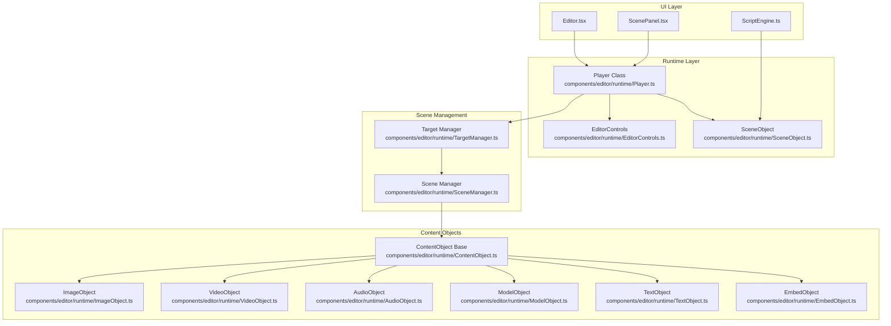

# Pictarize Studio Architecture Mirroring Plan

## Executive Summary

This document outlines a plan to restructure the Pictarize Studio editor to mirror the architecture found in the `refcode` folder. The refcode provides a well-organized, object-oriented architecture for managing scenes, content objects, and runtime interactions.

## Current Architecture Analysis

### What Already Exists ✅

| Component | Current Location | Status |
|-----------|------------------|--------|
| Base ContentObject | [`components/editor/runtime/RuntimeObjects.ts`](components/editor/runtime/RuntimeObjects.ts:9) | Partial - TypeScript class exists |
| Video Runtime Object | [`components/editor/runtime/RuntimeObjects.ts`](components/editor/runtime/RuntimeObjects.ts:63) | Implemented |
| Embed Runtime Object | [`components/editor/runtime/RuntimeObjects.ts`](components/editor/runtime/RuntimeObjects.ts:91) | Implemented |
| Model Runtime Object | [`components/editor/runtime/RuntimeObjects.ts`](components/editor/runtime/RuntimeObjects.ts:116) | Implemented |
| Audio Runtime Object | [`components/editor/runtime/RuntimeObjects.ts`](components/editor/runtime/RuntimeObjects.ts:160) | Implemented |
| Script Engine | [`components/editor/ScriptEngine.ts`](components/editor/ScriptEngine.ts:1) | Fully functional |
| Scene Rendering | [`components/editor/ScenePanel.tsx`](components/editor/ScenePanel.tsx:1) | Complex but working |
| Editor Orchestrator | [`components/editor/Editor.tsx`](components/editor/Editor.tsx:1) | Main component |
| Chroma Key Material | [`components/editor/ChromaKeyMaterial.tsx`](components/editor/ChromaKeyMaterial.tsx:1) | Custom shader exists |

### Gaps Identified ❌

| Gap | Refcode Equivalent | Priority |
|-----|-------------------|----------|
| No Player class | [`refcode/lib/src/scene/player/Player.js`](refcode/lib/src/scene/player/Player.js:19) | HIGH |
| No ObjectBuilder pattern | ContentObject classes | HIGH |
| No EditorControls class | [`refcode/lib/src/scene/EditorControls.js`](refcode/lib/src/scene/EditorControls.js:1) | MEDIUM |
| No SceneObject API wrapper | [`refcode/lib/src/scene/player/SceneObject.js`](refcode/lib/src/scene/player/SceneObject.js:1) | MEDIUM |
| Content rendering mixed in ScenePanel | Separate component files | MEDIUM |

---

## Target Architecture

### Mermaid Diagram - Target Structure



---

## Implementation Plan

### Phase 1: Core Runtime Classes (HIGH Priority)

#### 1.1 Create Player Class
**File:** `components/editor/runtime/Player.ts`

```typescript
// Responsibilities:
// - Initialize THREE.js scene, camera, renderer
// - Manage multiple targets
// - Handle animation loop
// - Coordinate object creation via ObjectBuilders
// - Dispatch script events (onInit, onActivate, onDeactivate, onUpdate, onClick)
// - Handle raycasting for object selection

class Player {
  // Properties
  container: HTMLElement
  scene: THREE.Scene
  camera: THREE.PerspectiveCamera
  renderer: THREE.WebGLRenderer
  cssRenderer: CSS3DRenderer
  targets: Map<string, TargetRuntime>
  selectedTarget: TargetRuntime | null
  
  // Methods
  init(targets: Target[]): Promise<void>
  startTarget(targetIndex: number): void
  stopTarget(): void
  dispose(): void
  resize(): void
  requestRenderer(): Promise<THREE.WebGLRenderer>
}
```

#### 1.2 Create ContentObject Base Class
**File:** `components/editor/runtime/ContentObject.ts`

Refactor existing [`RuntimeObjects.ts`](components/editor/runtime/RuntimeObjects.ts:9) into:
- Base class with transform management
- Script wrapper generation
- Lifecycle methods (init, activate, deactivate, dispose)

#### 1.3 Create ContentObject Subclasses
**Files:** 
- `components/editor/runtime/ImageObject.ts`
- `components/editor/runtime/VideoObject.ts` (refactor existing)
- `components/editor/runtime/AudioObject.ts` (refactor existing)
- `components/editor/runtime/ModelObject.ts` (refactor existing)
- `components/editor/runtime/TextObject.ts`
- `components/editor/runtime/EmbedObject.ts` (refactor existing)

Each should follow the pattern:
```typescript
class XxxObject extends ContentObject {
  async init(content: Content): Promise<void>
  activate(): void
  deactivate(): void
  dispose(): void
  createScriptWrapper(): XxxScriptAPI
}
```

### Phase 2: Scene Management (MEDIUM Priority)

#### 2.1 Create EditorControls
**File:** `components/editor/runtime/EditorControls.ts`

Port from [`refcode/lib/src/scene/EditorControls.js`](refcode/lib/src/scene/EditorControls.js:1):
- Orbit/pan/zoom controls
- Touch support
- Focus on object

#### 2.2 Create SceneObject
**File:** `components/editor/runtime/SceneObject.ts`

From [`refcode/lib/src/scene/player/SceneObject.js`](refcode/lib/src/scene/player/SceneObject.js:1):
```typescript
class SceneObject {
  getObject(name: string): ContentObject | null
  captureScreen(): void
  // Plus any system control APIs
}
```

#### 2.3 Create TargetManager
**File:** `components/editor/runtime/TargetManager.ts`

Manages multiple targets:
- Track switching between targets
- Maintain target state
- Handle visibility

### Phase 3: Integration (MEDIUM Priority)

#### 3.1 Refactor ScenePanel.tsx
Break down into smaller components:
- `ScenePanel.tsx` - Container only
- `SceneCanvas.tsx` - THREE.js canvas setup
- `SceneContent.tsx` - Content rendering
- `TransformControls.tsx` - Transform gizmos

#### 3.2 Connect Player to Editor
Update [`Editor.tsx`](components/editor/Editor.tsx:1) to:
- Initialize Player instance
- Pass Player to ScenePanel
- Coordinate state updates

#### 3.3 Enhance ScriptEngine Integration
Update [`ScriptEngine.ts`](components/editor/ScriptEngine.ts:1) to:
- Use Player's SceneObject for API
- Leverage new object lifecycle
- Support multi-target scripts

### Phase 4: Polish & Features (LOW Priority)

#### 4.1 ChromaKey Material Enhancement
Enhance [`ChromaKeyMaterial.tsx`](components/editor/ChromaKeyMaterial.tsx:1) to match refcode shader

#### 4.2 CSS3D Support
Add support for embed content using CSS3DRenderer (like refcode EmbedContentObject)

#### 4.3 Animation System
Enhance model animation handling to match refcode (actions, mixer management)

---

## File Structure After Implementation

```
components/editor/
├── runtime/
│   ├── Player.ts              # NEW - Main orchestrator
│   ├── EditorControls.ts      # NEW - Camera controls
│   ├── SceneObject.ts         # NEW - Script API wrapper
│   ├── TargetManager.ts       # NEW - Target management
│   ├── ContentObject.ts       # REFACTORED - Base class
│   ├── ImageObject.ts         # NEW
│   ├── VideoObject.ts         # REFACTORED from RuntimeObjects
│   ├── AudioObject.ts         # REFACTORED from RuntimeObjects
│   ├── ModelObject.ts         # REFACTORED from RuntimeObjects
│   ├── TextObject.ts          # NEW
│   ├── EmbedObject.ts         # REFACTORED from RuntimeObjects
│   └── index.ts               # NEW - Barrel export
├── Editor.tsx                 # UPDATED - Use Player
├── ScenePanel.tsx             # REFACTORED - Simplified
├── ScriptEngine.ts            # UPDATED - Use new architecture
├── ChromaKeyMaterial.tsx      # ENHANCED
└── ...
```

---

## Migration Strategy

1. **Incremental Implementation**: Add new classes without breaking existing code
2. **Parallel Operation**: Keep existing implementation alongside new
3. **Gradual Migration**: Move content one type at a time
4. **Feature Flags**: Toggle between old/new implementations

### Step-by-Step Migration

1. Create `runtime/` directory structure
2. Implement `Player.ts` class
3. Refactor `ContentObject` hierarchy
4. Add `EditorControls.ts`
5. Create `SceneObject.ts`
6. Update `ScenePanel.tsx` to use new classes
7. Update `Editor.tsx` to initialize Player
8. Update `ScriptEngine.ts` to use new architecture

---

## Benefits of Mirrored Architecture

| Benefit | Description |
|---------|-------------|
| **Maintainability** | Clear separation of concerns |
| **Extensibility** | Easy to add new content types |
| **Testability** | Runtime classes can be unit tested |
| **Performance** | Lifecycle management prevents memory leaks |
| **Consistency** | Matches proven refcode patterns |
| **Collaboration** | Familiar structure for refcode developers |

---

## Risks & Mitigations

| Risk | Impact | Mitigation |
|------|--------|-------------|
| Breaking changes | Could disrupt current workflow | Incremental migration, feature flags |
| Performance regression | New abstraction overhead | Benchmark before/after, optimize hot paths |
| Missing features | Some refcode features not ported | Document gaps, prioritize essential features |

---

## Next Steps

1. **Approve this plan** - Review and confirm direction
2. **Start Phase 1** - Create Player class and ContentObject hierarchy
3. **Iterate** - Deliver in phases, gather feedback

---

*Plan created: 2026-02-21*
*Reference: refcode/lib/src/scene/player/*
