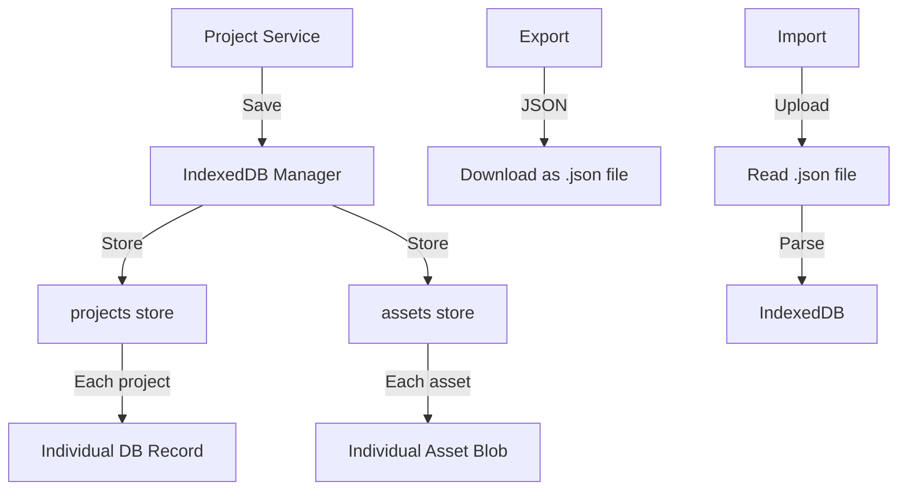
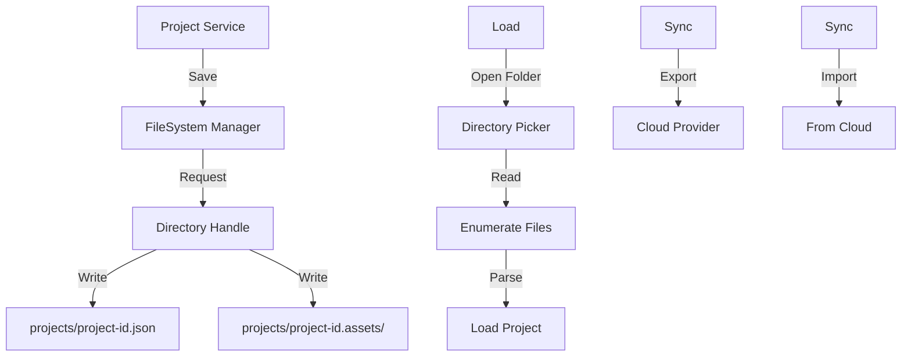
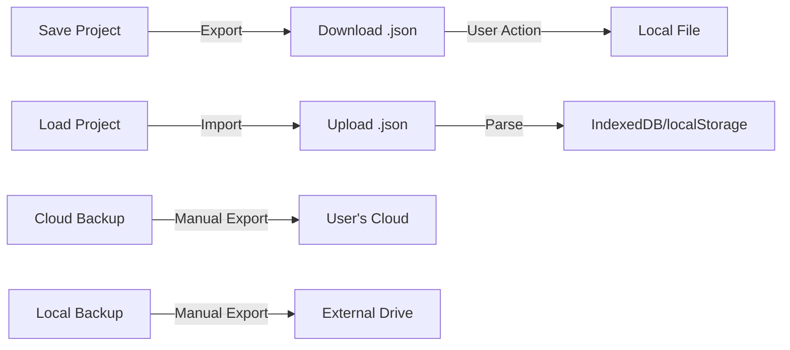
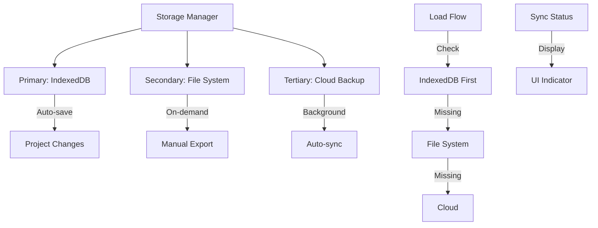

# Local File-Based Storage Architecture Plan

## Executive Summary

This document outlines implementation approaches for saving each project as an individual file in a local folder, replacing the current localStorage-based approach that stores all projects together. The goal is to provide similar functionality to the Supabase cloud backup feature but with local file-based storage.

---

## Current Architecture Analysis

### Existing Storage Model
- **Primary Storage**: Supabase (cloud) - stores full project JSON in `data` column
- **Fallback Storage**: localStorage via `utils/storageManager.ts`
- **Key Issues with localStorage**:
  - 5-10MB quota limit (compresses projects, loses data)
  - All projects stored in single key: `papar_projects`
  - No individual file access
  - No easy backup/restore
  - Data loss risk when quota exceeded

### Project Data Structure
```typescript
interface Project {
  id: string;
  name: string;
  targets: Target[];
  assets?: Asset[];
  mindARConfig?: MindARConfig;
  lastUpdated: string;
  status: 'Draft' | 'Published';
  sizeMB: number;
  publishedSlug?: string;
  templateId?: string;
  templateName?: string;
}
```

---

## Implementation Options

### Option 1: IndexedDB with Individual Project Files

**Description**: Use IndexedDB (browser's built-in database) to store each project as a separate record, providing more storage capacity than localStorage.

**Architecture**:


**Implementation Details**:
- Create `utils/indexedDBManager.ts` with Dexie.js wrapper
- Two object stores: `projects` (metadata), `assets` (binary data)
- Each project stored with unique key (project.id)
- Support for lazy loading of assets

**Advantages**:
- ✅ 50MB+ storage capacity (vs 5-10MB localStorage)
- ✅ Individual project access (no need to load all)
- ✅ Built-in indexing for fast queries
- ✅ Supports binary assets (blobs)
- ✅ Works offline in all modern browsers
- ✅ Can export individual projects as JSON files

**Disadvantages**:
- ❌ Browser-specific (works in all modern browsers)
- ❌ No direct file system access
- ❌ Requires migration from localStorage
- ❌ Still limited to browser context

**Storage Capacity**: ~50-500MB depending on browser

---

### Option 2: Browser File System Access API

**Description**: Use the modern File System Access API to allow users to save projects directly to their local file system with full read/write permissions.

**Architecture**:


**Implementation Details**:
- Create `utils/fileSystemManager.ts`
- User grants permission to a "projects" folder
- Each project saved as: `projects/{project-id}/{project-data.json, assets/}`
- Directory structure supports multiple projects

**Advantages**:
- ✅ True local file system access
- ✅ Unlimited storage (disk space dependent)
- ✅ Easy backup (copy folder to USB/cloud)
- ✅ Native file management (rename, delete in OS)
- ✅ Version control friendly (can use Git)

**Disadvantages**:
- ❌ Only works in Chromium browsers (Chrome, Edge)
- ❌ Firefox/Safari not supported
- ❌ Requires user permission each session (or persist)
- ❌ More complex error handling

**Storage Capacity**: Unlimited (disk space)

---

### Option 3: Download/Upload JSON File Approach

**Description**: Manual export/import workflow where users download projects as JSON files and can upload them back.

**Architecture**:


**Implementation Details**:
- Extend existing `exportUtils.ts` functions
- Add "Export Project" and "Import Project" buttons in UI
- Project JSON includes all data (no separate asset handling)
- Support for ZIP export (for larger projects with assets)

**Advantages**:
- ✅ Works in all browsers
- ✅ Simple to implement
- ✅ User has full control over files
- ✅ Easy to share projects
- ✅ Compatible with any cloud storage

**Disadvantages**:
- ❌ Manual process (not automatic)
- ❌ No sync between local and cloud
- ❌ User must remember to export
- ❌ No real-time backup

**Storage Capacity**: Unlimited (disk space)

---

### Option 4: Hybrid Approach (Recommended)

**Description**: Combine multiple storage methods with automatic sync capabilities.

**Architecture**:


**Implementation Details**:
1. **Primary Storage**: IndexedDB (auto-save, fast)
2. **Export Target**: File System Access API (when available) or JSON download
3. **Cloud Sync**: Supabase (existing) or manual export to cloud drive
4. **UI Components**:
   - Storage status indicator
   - Manual export/import buttons
   - Sync status display
   - Storage quota warning

**Advantages**:
- ✅ Best of all approaches
- ✅ Graceful fallback (browser support)
- ✅ Automatic with manual override
- ✅ Clear sync status
- ✅ Future-proof

**Disadvantages**:
- ❌ Most complex to implement
- ❌ Requires careful conflict resolution
- ❌ More testing needed

**Storage Capacity**: IndexedDB (50-500MB) + File System (unlimited)

---

## Comparison Matrix

| Feature | localStorage (Current) | IndexedDB | File System API | JSON Export | Hybrid |
|---------|----------------------|-----------|-----------------|-------------|--------|
| Storage Limit | 5-10MB | 50-500MB | Unlimited | Unlimited | Unlimited |
| Individual Files | ❌ | ✅ | ✅ | ✅ | ✅ |
| Browser Support | ✅ All | ✅ All | ⚠️ Chromium | ✅ All | ✅ All |
| Auto-save | ✅ | ✅ | ✅ | ❌ | ✅ |
| Manual Export | ❌ | ❌ | ❌ | ✅ | ✅ |
| Cloud Sync | ✅ Supabase | ⚠️ Manual | ⚠️ Manual | ⚠️ Manual | ✅ Auto |
| Implementation | — | Medium | Medium | Low | High |
| Asset Storage | ⚠️ URLs only | ✅ Blobs | ✅ Files | ⚠️ Base64 | ✅ Blobs |

---

## Recommended Implementation Plan

### Phase 1: IndexedDB Foundation (Priority: High)
1. Create `utils/indexedDBManager.ts` using Dexie.js
2. Implement project CRUD operations
3. Add asset blob storage
4. Update `projectService.ts` to use IndexedDB
5. Add migration from localStorage

### Phase 2: File Export/Import (Priority: High)
1. Add "Export Project" functionality to UI
2. Implement JSON + ZIP export for assets
3. Add "Import Project" functionality
4. Create project list from imported files

### Phase 3: File System Access (Priority: Medium)
1. Detect File System API support
2. Add "Open Projects Folder" option
3. Implement directory-based project storage
4. Add permission persistence

### Phase 4: Cloud Sync Enhancement (Priority: Medium)
1. Add manual cloud export option
2. Implement sync status indicators
3. Add conflict resolution UI
4. Support third-party cloud drives

---

## Implementation Priority

Based on your requirements for "similar functionality to Supabase cloud backup but local", I recommend:

1. **Start with Option 1 (IndexedDB)** - Immediate improvement over localStorage
2. **Add Option 3 (JSON Export)** - Quick win for backup functionality
3. **Implement Option 4 (Hybrid)** - Full-featured solution

This approach provides:
- Immediate storage capacity increase (10x+)
- Individual project files
- Easy backup/restore
- Future cloud sync capability

---

## Next Steps

To proceed with implementation, I recommend:

1. **Confirm preferred approach** - Let me know which options interest you most
2. **Review existing export code** - We can leverage `utils/exportUtils.ts`
3. **Define UI requirements** - What export/import buttons needed
4. **Plan migration** - How to move existing localStorage projects

Would you like me to proceed with implementing any of these options? I recommend starting with **Option 1 (IndexedDB)** as it provides the biggest immediate improvement with moderate implementation effort.
