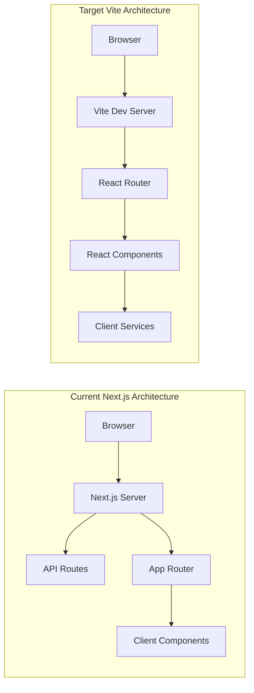
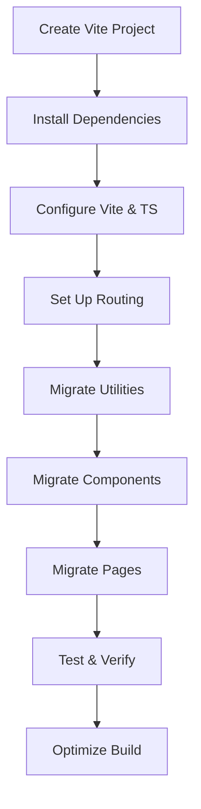

# Migration Plan: Next.js to Vite + React + TypeScript

## Executive Summary

This document outlines a comprehensive plan to convert the existing PapAR Studio application from Next.js 14 (App Router) to a Vite + React + TypeScript setup.

### Current Stack
| Component | Technology |
|-----------|------------|
| Framework | Next.js 14 (App Router) |
| UI Library | React 18 |
| Language | TypeScript |
| Styling | Tailwind CSS |
| 3D/AR | Three.js, @react-three/fiber, @react-three/drei, MindAR |
| State | React hooks (useState, useEffect) |
| Storage | localStorage, Supabase |

### Target Stack
| Component | Technology |
|-----------|------------|
| Build Tool | Vite 5.x |
| Framework | React 18+ |
| Language | TypeScript |
| Styling | Tailwind CSS |
| Routing | React Router 6 |
| 3D/AR | Three.js, @react-three/fiber, @react-three/drei, MindAR |

---

## Architecture Comparison



### Key Differences

| Aspect | Next.js (Current) | Vite (Target) |
|--------|-------------------|---------------|
| **Server-Side Rendering** | Yes (default) | No (SPA) |
| **API Routes** | Built-in `/api` routes | Separate backend or client-side |
| **Routing** | File-based (App Router) | Declarative (React Router) |
| **Build Output** | Server + Static | Static only |
| **Hot Reloading** | Yes | Yes (faster) |
| **"use client"** | Required for interactivity | Not needed |

---

## Detailed Migration Steps

### Phase 1: Project Setup

#### 1.1 Initialize Vite Project

```bash
# Create new Vite project with React TypeScript template
npm create vite@latest papar-studio -- --template react-ts

# Navigate to project
cd papar-studio

# Install all current dependencies
npm install next@^14.1.0 react@^18.2.0 react-dom@^18.2.0 three@^0.160.0 \
  @react-three/fiber@^8.15.16 @react-three/drei@^9.99.0 three-mesh-bvh@^0.8.0 \
  lucide-react@^0.309.0 uuid@^9.0.1 @supabase/supabase-js@^2.39.3 \
  react-player@^2.14.1 @wry/equality@^0.5.7 clsx@^2.1.0 \
  tailwind-merge@^2.2.0 lodash@^4.17.21 jszip@^3.10.1 qrcode@^1.5.3

# Install React Router
npm install react-router-dom@^6.x

# Install dev dependencies
npm install -D @types/node@^20.11.5 @types/react@^18.2.48 \
  @types/react-dom@^18.2.18 @types/uuid@^9.0.7 @types/three@^0.160.0 \
  @types/lodash@^4.14.202 @types/qrcode@^1.5.5 autoprefixer@^10.4.17 \
  postcss@^8.4.33 tailwindcss@^3.4.1 typescript@^5.3.3 vite@^5.x
```

#### 1.2 Configure Vite

Create/update `vite.config.ts`:

```typescript
import { defineConfig } from 'vite'
import react from '@vitejs/plugin-react-swc'
import path from 'path'

export default defineConfig({
  plugins: [react()],
  resolve: {
    alias: {
      '@': path.resolve(__dirname, './src'),
    },
  },
  server: {
    port: 3000,
    host: true,
  },
  build: {
    outDir: 'dist',
    sourcemap: true,
  },
})
```

---

### Phase 2: Directory Restructuring

#### 2.1 New Directory Structure

```
papar-studio/
├── src/
│   ├── components/          # React components
│   │   ├── dashboard/       # Dashboard components
│   │   ├── editor/         # Editor components
│   │   │   └── runtime/    # Runtime classes
│   │   ├── icons/          # Icon components
│   │   └── ui/             # UI components
│   ├── hooks/              # Custom React hooks
│   ├── pages/              # Route pages
│   │   ├── Dashboard.tsx
│   │   ├── Editor.tsx
│   │   └── Viewer.tsx
│   ├── services/           # API/service layer
│   ├── types/              # TypeScript types
│   ├── utils/              # Utility functions
│   ├── App.tsx             # Main app component
│   ├── main.tsx            # Entry point
│   └── index.css           # Global styles
├── public/                 # Static assets
├── index.html              # HTML entry
├── package.json
├── tsconfig.json
├── tailwind.config.js
├── postcss.config.js
└── vite.config.ts
```

#### 2.2 Key Migrations

| Original Location | New Location |
|-------------------|--------------|
| `app/page.tsx` | `src/pages/Dashboard.tsx` |
| `app/ClientPage.tsx` | `src/App.tsx` |
| `app/view/[id]/page.tsx` | `src/pages/Viewer.tsx` |
| `components/editor/Editor.tsx` | `src/pages/EditorPage.tsx` |
| `components/dashboard/*` | `src/components/dashboard/*` |
| `components/editor/*` | `src/components/editor/*` |
| `types.ts` | `src/types/index.ts` |
| `utils/*` | `src/utils/*` |
| `hooks/*` | `src/hooks/*` |
| `app/globals.css` | `src/index.css` |

---

### Phase 3: Routing Implementation

#### 3.1 Set Up React Router

Create `src/App.tsx`:

```typescript
import { BrowserRouter, Routes, Route } from 'react-router-dom'
import Dashboard from './pages/Dashboard'
import EditorPage from './pages/EditorPage'
import Viewer from './pages/Viewer'
import AppRunner from './pages/AppRunner'

function App() {
  return (
    <BrowserRouter>
      <Routes>
        <Route path="/" element={<Dashboard />} />
        <Route path="/editor/:id" element={<EditorPage />} />
        <Route path="/view/:id" element={<Viewer />} />
        <Route path="/apps/:id" element={<AppRunner />} />
      </Routes>
    </BrowserRouter>
  )
}

export default App
```

#### 3.2 Route Parameter Handling

Replace Next.js `useParams()`:
```typescript
// Next.js (current)
const params = useParams();
const id = params.id as string;

// React Router (new)
const { id } = useParams<{ id: string }>();
```

---

### Phase 4: Component Adaptation

#### 4.1 Remove Next.js Directives

| Remove | Action |
|--------|--------|
| `"use client"` | Delete (all components are client-side) |
| `import { useParams } from 'next/navigation'` | Replace with `react-router-dom` |
| `import Link from 'next/link'` | Replace with `react-router-dom`'s `<Link>` |
| `import Image from 'next/image'` | Use standard `` tag |
| `export const metadata` | Remove or use `react-helmet` |

#### 4.2 Import Changes

```typescript
// Before (Next.js)
import { useRouter } from 'next/navigation'
import Link from 'next/link'

// After (Vite)
import { useNavigate, Link } from 'react-router-dom'
```

#### 4.3 Update useEffect with Router

```typescript
// Before
const router = useRouter()
router.push('/dashboard')

// After
const navigate = useNavigate()
navigate('/dashboard')
```

---

### Phase 5: API Route Conversion

#### 5.1 Current API Routes

| Route | Purpose | Migration |
|-------|---------|-----------|
| `GET /api/projects` | List all projects | Client service |
| `POST /api/projects` | Save projects | Client service |
| `GET /app/[id]` | Get project for app | Client service |

#### 5.2 Create Service Layer

Create `src/services/projectService.ts`:

```typescript
import { Project } from '../types'

const STORAGE_KEY = 'papar_projects'

export const loadProjects = async (): Promise<Project[]> => {
  const data = localStorage.getItem(STORAGE_KEY)
  return data ? JSON.parse(data) : []
}

export const saveProjects = async (projects: Project[]): Promise<boolean> => {
  try {
    localStorage.setItem(STORAGE_KEY, JSON.stringify(projects))
    return true
  } catch (e) {
    console.error('Failed to save projects', e)
    return false
  }
}

export const getProjectById = async (id: string): Promise<Project | null> => {
  const projects = await loadProjects()
  return projects.find(p => p.id === id) || null
}
```

---

### Phase 6: Environment Variables

#### 6.1 Create .env Files

```
# .env.development
VITE_SUPABASE_URL=your-supabase-url
VITE_SUPABASE_ANON_KEY=your-anon-key

# .env.production
VITE_SUPABASE_URL=your-supabase-url
VITE_SUPABASE_ANON_KEY=your-anon-key
```

#### 6.2 Update Code to Use Vite Env

```typescript
// Before
process.env.NEXT_PUBLIC_SUPABASE_URL

// After
import.meta.env.VITE_SUPABASE_URL
```

---

### Phase 7: Tailwind CSS Configuration

#### 7.1 Update Configuration

Copy existing `tailwind.config.js` and update:

```javascript
/** @type {import('tailwindcss').Config} */
export default {
  content: [
    "./index.html",
    "./src/**/*.{js,ts,jsx,tsx}",
  ],
  darkMode: 'class',
  theme: {
    extend: {
      // Keep existing custom colors
    },
  },
  plugins: [],
}
```

#### 7.2 Create src/index.css

```css
@tailwind base;
@tailwind components;
@tailwind utilities;

/* Keep existing custom styles from globals.css */
:root {
  /* CSS variables */
}

.dark {
  /* Dark theme */
}
```

---

### Phase 8: Entry Point

#### 8.1 Update main.tsx

```typescript
import React from 'react'
import ReactDOM from 'react-dom/client'
import App from './App'
import './index.css'

ReactDOM.createRoot(document.getElementById('root')!).render(
  <React.StrictMode>
    <App />
  </React.StrictMode>,
)
```

#### 8.2 Update index.html

```html
<!DOCTYPE html>
<html lang="en" class="dark">
  <head>
    <meta charset="UTF-8" />
    <link rel="icon" type="image/svg+xml" href="/vite.svg" />
    <meta name="viewport" content="width=device-width, initial-scale=1.0" />
    <title>PapAR Studio</title>
  </head>
  <body>
    <div id="root"></div>
    <script type="module" src="/src/main.tsx"></script>
  </body>
</html>
```

---

### Phase 9: Testing Checklist

- [ ] Dashboard loads and displays project list
- [ ] Can create new project from template
- [ ] Can open project in editor
- [ ] Can save project changes
- [ ] Can delete project
- [ ] Editor scene renders 3D content
- [ ] Can add/edit/remove scene objects
- [ ] Viewer page loads project
- [ ] Published app page works
- [ ] Build completes without errors

---

### Phase 10: Build Optimization

#### 10.1 Vite Config for Production

```typescript
export default defineConfig({
  build: {
    rollupOptions: {
      output: {
        manualChunks: {
          'three': ['three', '@react-three/fiber', '@react-three/drei'],
          'vendor': ['react', 'react-dom', 'react-router-dom'],
        },
      },
    },
  },
})
```

---

## Migration Order



---

## Risks & Mitigations

| Risk | Impact | Mitigation |
|------|--------|------------|
| SSR features lost | Some Next.js features unavailable | Migrate to client-side alternatives |
| API routes removed | Need separate backend or client-side | Use localStorage or external API |
| Image optimization | Less efficient than next/image | Use lazy loading, proper sizing |
| SEO impact | SPA has less SEO | Use SSR if needed, or static generation |
| Build size | Larger bundle | Code splitting, chunking |

---

## Benefits of Migration

1. **Faster development** - Instant hot reload
2. **Simpler architecture** - No server-side complexity
3. **More control** - Full control over build process
4. **Easier deployment** - Static hosting only
5. **Smaller bundle** - Better tree-shaking

---

*Plan created: 2026-02-22*
*For implementation, switch to Code mode*
