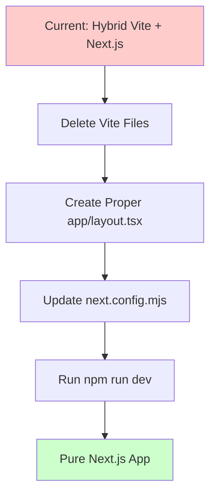

# Migration Plan: Vite to Proper Next.js

## Problem Analysis

The application currently has a **hybrid architecture** that's causing conflicts:

### Current Setup
- **Vite entry point**: `index.tsx` → renders directly to DOM via `createRoot`
- **Next.js App Router**: `app/layout.tsx`, `app/page.tsx` (not being used)
- **Import maps**: Defined in `index.html` loading ESM modules from esm.sh

### Root Cause of Error
```
Uncaught Error: Invariant: Missing ActionQueueContext
```

This error occurs because:
1. `index.tsx` renders the app bypassing Next.js SSR/hydration
2. Next.js Router components get initialized in an incomplete context
3. The React DevTools middleware or context providers aren't properly initialized

## Solution

Remove Vite completely and use **pure Next.js** with npm packages.

### Dependencies Already Available
All packages used in the import map are already in `package.json`:
- react, react-dom
- three, @react-three/fiber, @react-three/drei
- uuid, @wry/equality
- react-player
- @supabase/supabase-js
- jszip, qrcode

## Migration Steps

### Step 1: Delete Vite Files
Delete these files that create the Vite entry point:
- `index.html`
- `index.tsx`
- `vite.config.ts`
- `App.tsx` (empty file)

### Step 2: Create Proper app/layout.tsx
Replace the current layout with a clean Server Component:

```tsx
import type { Metadata } from 'next';
import './globals.css';

export const metadata: Metadata = {
  title: 'PapAR Studio',
  description: 'A professional web-based AR editor.',
};

export default function RootLayout({
  children,
}: {
  children: React.ReactNode;
}) {
  return (
    <html lang="en" className="dark">
      <head>
        <meta charSet="utf-8" />
        <meta name="viewport" content="width=device-width, initial-scale=1" />
      </head>
      <body className="bg-background-primary text-text-primary overflow-x-hidden m-0 p-0">
        {children}
      </body>
    </html>
  );
}
```

### Step 3: Ensure app/page.tsx is Client Component
The `app/page.tsx` already has `"use client"` directive - this is correct for interactive components.

### Step 4: Update next.config.mjs
Add transpile packages for Three.js ecosystem if needed:

```js
const nextConfig = {
  transpilePackages: ['three', '@react-three/fiber', '@react-three/drei'],
  // ... existing config
};
```

### Step 5: Run Next.js
```bash
npm run dev
```

## Mermaid Diagram


