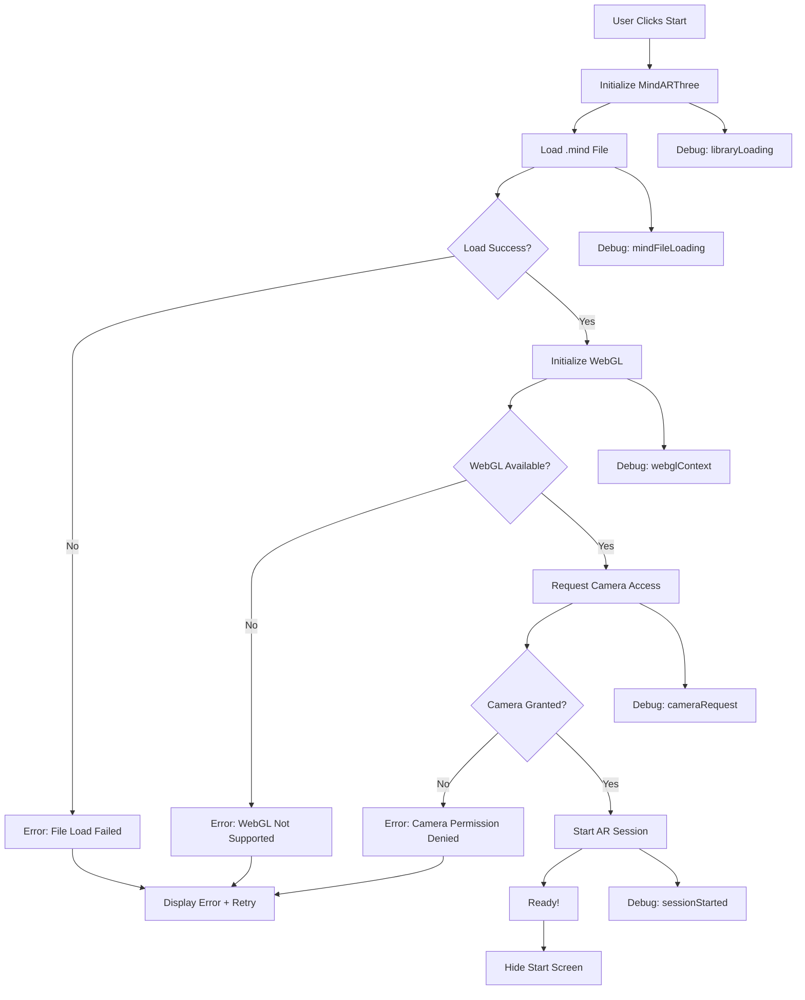

# MindAR Initialization Deadlock - Debug Plan

## Executive Summary

The published AR application gets stuck on an "Initializing" screen while loading the MindAR library. This plan addresses comprehensive debugging and root cause resolution.

## AR Pipeline Analysis

```
User Request → AppRunner.tsx → generateAFrameHtml() → HTML iframe → MindARThree.init() → Camera Ready
```

### Current Implementation Flow

1. [`AppRunner.tsx`](src/pages/AppRunner.tsx:1) - Fetches project and generates HTML
2. [`generateAFrameHtml()`](utils/exportUtils.ts:294) - Creates HTML with MindAR integration
3. [`Player.init()`](utils/exportUtils.ts:705) - Initializes MindARThree instance
4. [`mindarThree.start()`](utils/exportUtils.ts:811) - Starts camera (blocking point)

## Potential Root Causes

### 1. Library Loading Issues
- **CDN Availability**: MindAR loaded from `https://cdn.jsdelivr.net/npm/mind-ar@1.2.5/dist/mindar-image-three.prod.js`
- **Import Map Errors**: Potential version incompatibility between Three.js 0.160.0 and MindAR 1.2.5
- **Minification Issues**: Production builds may have different behavior

### 2. CORS Configuration Problems
- `.mind` file loaded via fetch may not have proper CORS headers
- CDN resources might be blocked by CSP
- Cross-origin resource sharing failures

### 3. Camera Permission Conflicts
- Browser blocks camera access without HTTPS
- Multiple permission prompts causing deadlock
- Device-specific camera API differences

### 4. WebGL Context Restrictions
- Mobile devices with hardware acceleration disabled
- Memory constraints on low-end devices
- WebGL context lost during initialization

### 5. Asset Loading Issues
- Missing or corrupted `.mind` file
- Invalid asset URLs in production
- Network timeouts not handled

### 6. Asynchronous Race Conditions
- Promises not properly awaited in [`Player.init()`](utils/exportUtils.ts:705)
- Component unmount during async operations
- No timeout on initialization

## Solution Architecture

### Enhanced Debug System (New File: utils/mindar-debug.ts)

```typescript
// Comprehensive logging pipeline
- DebugLogger class with levels: DEBUG, INFO, WARN, ERROR
- Captures: library init, tracker config, camera permissions, 
  WebGL context, asset loading progress, errors, warnings
- Outputs to: console + parent window postMessage + on-screen overlay
```

### Key Improvements to generateAFrameHtml()

1. **Enhanced Initialization with Debug Logging**
2. **Timeout Protection** (30-second max)
3. **Graceful Error Recovery**
4. **Memory Management**
5. **WebGL Context Monitoring**

## Implementation Steps

### Step 1: Create Enhanced Debug Logging System
- File: `utils/mindar-debug.ts`
- Features: Timestamped logs, error categorization, performance metrics

### Step 2: Update generateAFrameHtml() 
- Add comprehensive debug logging throughout initialization
- Implement timeout mechanism
- Add error boundary and recovery

### Step 3: Enhance AppRunner.tsx Debug Panel
- Expand debug overlay with more detailed status
- Add manual refresh/retry capability

### Step 4: Add Vercel Configuration (vercel.json)
- Ensure proper headers for .mind file MIME types
- Configure caching strategies

## Mermaid Diagram: Initialization Flow



## Files to Modify

| File | Changes |
|------|---------|
| `utils/mindar-debug.ts` | New - Comprehensive debug system |
| `utils/exportUtils.ts` | Update generateAFrameHtml() with debug + timeout |
| `src/pages/AppRunner.tsx` | Enhance debug overlay |
| `vercel.json` | Add MIME types for .mind files |

## Expected Outcomes

1. **Immediate**: Full visibility into initialization pipeline
2. **Root Cause**: Clear error messages identify the deadlock cause
3. **Recovery**: Automatic retry or graceful error display
4. **Production Ready**: Timeout protection prevents infinite loading
