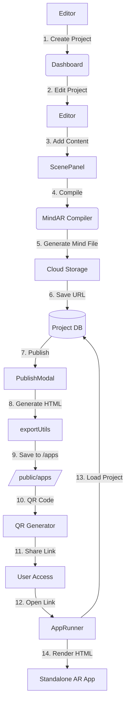
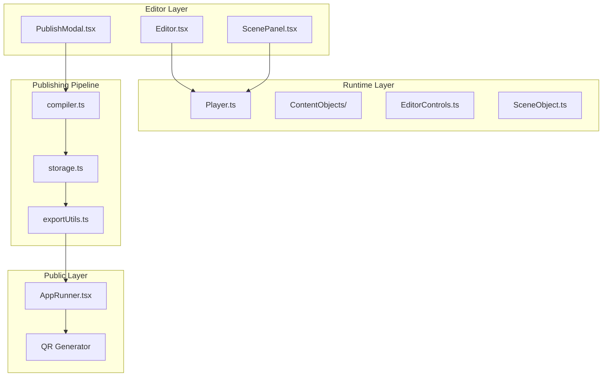

# Publishing Pipeline Architecture Improvement Plan

## Executive Summary

This document outlines a comprehensive plan to improve and overhaul the publishing pipeline for Pictarize Studio. The plan analyzes the existing refcode architecture and current implementation, then provides detailed steps to align the current system with the refcode patterns while adding required features.

### Key Requirements
- Remove Download ZIP option from publish dialog
- Output published projects to `/apps` public folder
- Maintain existing naming conventions
- Mirror publishing dialog from refcode
- Ensure all published projects are standalone web apps

---

## 1. Current Architecture Analysis

### 1.1 Refcode Architecture (Reference)

**Location:** `C:/Users/Billy/Documents/papar-studio8/refcode/`

**Key Components:**
| Component | File | Purpose |
|-----------|------|---------|
| Player | `lib/src/scene/player/Player.js` | Main runtime orchestrator |
| ContentObject | `lib/src/scene/player/ContentObject.js` | Base class for all content |
| VideoAssetObject | `lib/src/scene/player/VideoAssetObject.js` | Video content handler |
| GLBAssetObject | `lib/src/scene/player/GLBAssetObject.js` | 3D model handler |
| SceneObject | `lib/src/scene/player/SceneObject.js` | Script API wrapper |
| EditorControls | `lib/src/scene/EditorControls.js` | Camera controls |

### 1.2 Current Implementation Status

**Working Components:**
| Component | Location | Status |
|-----------|----------|--------|
| MindAR Compiler | `utils/compiler.ts` | ✅ Working |
| Publish Modal | `components/editor/PublishModal.tsx` | ✅ Functional |
| App Runner | `src/pages/AppRunner.tsx` | ✅ Serves published apps |
| HTML Generator | `utils/exportUtils.ts` | ✅ Generates standalone HTML |
| QR Code Generation | `PublishModal.tsx:85` | ✅ Works |
| Runtime Player | `components/editor/runtime/Player.ts` | ✅ Mirrors refcode |

**Issues Identified:**
| Issue | Impact | Priority |
|-------|--------|----------|
| Download ZIP option exists | Should be removed | HIGH |
| Published apps in iframe | Camera access issues | HIGH |
| No debug overlay in published apps | Cannot troubleshoot MindAR | HIGH |
| No MindAR event logging | Can't track tracking status | MEDIUM |
| Scanner overlay not visible | User confusion | MEDIUM |

---

## 2. Target Architecture

### 2.1 Publishing Flow



### 2.2 Published App Structure

```
/public/apps/[project-slug]/
├── index.html          # Main standalone app
├── assets/            # Media assets
│   ├── [content-id].jpg
│   ├── [content-id].mp4
│   └── [content-id].glb
└── targets.mind       # Compiled MindAR file
```

### 2.3 Component Architecture



---

## 3. Implementation Plan

### Phase 1: PublishModal Improvements (HIGH Priority)

#### 1.1 Remove Download ZIP Option
**File:** `components/editor/PublishModal.tsx`

**Changes:**
- Remove `handleDownloadZip` function (lines 149-171)
- Remove ZIP download button from UI (lines 232-238)
- Update UI layout to remove ZIP section

**Code Changes:**
```typescript
// Remove these lines:
// const handleDownloadZip = async () => { ... }

// Remove button:
// <button onClick={handleDownloadZip} className="...">Download ZIP</button>
```

#### 1.2 Improve Publishing Flow
**File:** `components/editor/PublishModal.tsx`

**Enhancements:**
- Add progress indication for each step
- Add step indicator (1. Compile → 2. Upload → 3. Generate Link)
- Improve error handling and user feedback

#### 1.3 Generate Standalone HTML File
**New Functionality:** Save HTML to public folder

**File:** `utils/exportUtils.ts`

**Changes:**
- Modify `generateProjectZip` to save HTML file to `/public/apps/[slug]/`
- Create directory structure automatically
- Handle asset bundling

---

### Phase 2: HTML Generator Enhancements (HIGH Priority)

#### 2.1 Enhance Debug Overlay
**File:** `utils/exportUtils.ts` (generateAFrameHtml function)

**Improvements:**
- Add persistent debug overlay toggle
- Show MindAR library loading status
- Show camera status
- Show target tracking status
- Display FPS counter

**Code Structure:**
```javascript
class DebugOverlay {
    constructor() {
        this.element = document.createElement('div');
        this.element.id = 'debug-overlay';
    }
    
    update(state) {
        // Update debug information
    }
}
```

#### 2.2 MindAR Event Listeners

**Add comprehensive event tracking:**
```javascript
const MINDAR_EVENTS = {
    'arReady': 'AR System Ready',
    'arError': 'AR Error', 
    'targetFound': 'Target Detected',
    'targetLost': 'Target Lost',
    'cameraReady': 'Camera Ready',
    'loadingProgress': 'Loading Progress'
};
```

#### 2.3 Scanner Overlay Visibility

**Ensure MindAR's built-in scanner UI is visible:**
```javascript
const mindarThree = new MindARThree({
    imageTargetSrc: mindFileUrl,
    uiLoading: "yes",
    uiScanning: "yes",  // Show scanner overlay
    uiError: "yes"
});
```

---

### Phase 3: AppRunner Improvements (HIGH Priority)

#### 3.1 Replace Iframe with Direct Rendering
**File:** `src/pages/AppRunner.tsx`

**Current Issue:** Published apps run in iframe, causing camera access problems

**Solution:** Serve HTML directly from file system

**Changes:**
- Remove iframe wrapper
- Load HTML file directly
- Handle cross-origin properly

#### 3.2 Enhanced Debug Overlay Component

**Add comprehensive debug overlay:**
```typescript
interface DebugState {
    mindarLoaded: boolean;
    mindarLoading: boolean;
    mindarError: string | null;
    cameraReady: boolean;
    targetsFound: number[];
    lastEvent: string;
    fps: number;
    debugLog: DebugLogEntry[];
}
```

---

### Phase 4: File Organization (HIGH Priority)

#### 4.1 Create Published Apps Directory Structure
**Path:** `/public/apps/[project-slug]/`

**Files to generate:**
```
/public/apps/[slug]/
├── index.html
├── assets/
│   ├── [content-id].jpg
│   ├── [content-id].mp4
│   └── [content-id].glb
└── targets.mind
```

#### 4.2 Naming Convention

**Maintain existing convention:**
- Use project name converted to slug: `project.name.toLowerCase().replace(/\s+/g, '-')`
- Example: "My Project" → `/apps/my-project/`

#### 4.3 Static File Generation

**File:** `utils/exportUtils.ts`

**Add function:**
```typescript
export const saveProjectToPublic = async (
    project: Project,
    mindFileUrl: string
): Promise<string> => {
    // Generate HTML
    const html = generateAFrameHtml(project, undefined, mindFileUrl);
    
    // Create directory structure
    const slug = project.name.toLowerCase().replace(/\s+/g, '-');
    const publicPath = `/apps/${slug}`;
    
    // Save files to public folder (handled by server-side or build process)
    return publicPath;
};
```

---

### Phase 5: Integration (MEDIUM Priority)

#### 5.1 Update Routes
**File:** `src/App.tsx`

**Current:** `/apps/:id` supports both ID and slug

**Enhancement:** Add route for `/apps/:slug` with better slug handling

#### 5.2 Connect PublishModal to File Generation
**File:** `components/editor/PublishModal.tsx`

**Add:**
- Call file generation after successful compilation
- Handle file save errors
- Show success message with app URL

---

## 4. File Changes Summary

| File | Changes | Priority |
|------|---------|----------|
| `components/editor/PublishModal.tsx` | Remove ZIP, improve UX, add file saving | HIGH |
| `utils/exportUtils.ts` | Add debug overlay, file generation | HIGH |
| `src/pages/AppRunner.tsx` | Remove iframe, improve debug | HIGH |
| `src/App.tsx` | Update routes if needed | MEDIUM |
| `types.ts` | Add any new type definitions | LOW |

---

## 5. Technical Specifications

### 5.1 Debug Overlay Specification

**Visual Design:**
- Position: Top-right corner
- Default: Hidden (toggle with button)
- Background: Semi-transparent black
- Text: Green/White monospace
- Font size: 12px

**Data Display:**
```
┌─ MindAR Debug ─────────────────┐
│ Library: ✅ Loaded             │
│ Camera:  ✅ Ready              │
│ Mind File: ✅ Loaded           │
│                                │
│ Events:                        │
│ [14:32:15] targetFound: 0     │
│ [14:32:18] targetFound: 1      │
│ [14:32:25] targetLost: 0       │
│                                │
│ FPS: 60                        │
│ Targets: 2/2 found             │
└────────────────────────────────┘
```

### 5.2 PublishModal UI Structure

```
┌─────────────────────────────────────┐
│ Publish Project                [X]  │
├─────────────────────────────────────┤
│                                     │
│ 1. Compile Target Images           │
│ ┌─────────────────────────────────┐ │
│ │ ████████████████████ 100%      │ │
│ └─────────────────────────────────┘ │
│ [      Compile / Re-Compile       ] │
│                                     │
│ 2. Share & Download                │
│ ┌─────────────────────────────────┐ │
│ │ Public App Link                 │ │
│ │ [link..................] [Copy] │ │
│ │ [Open]                          │ │
│ └─────────────────────────────────┘ │
│ ┌─────────────────────────────────┐ │
│ │ [QR Code Image]                 │ │
│ │ [Download QR Code]              │ │
│ └─────────────────────────────────┘ │
│                                     │
│ [         Done                   ] │
└─────────────────────────────────────┘
```

### 5.3 Error Handling

| Error | User Message | Action |
|-------|--------------|--------|
| Compilation failed | "Failed to compile target images. Please try again." | Show retry button |
| Upload failed | "Failed to upload to cloud storage. Check your configuration." | Show config help |
| Project not found | "Project not found. It may not exist or has not been published." | Show link to editor |
| Camera access denied | "Camera access denied. Please allow camera permissions." | Show instructions |

---

## 6. Migration Steps

### Step 1: Backup Current Implementation
- Create backup of existing files
- Document current configuration

### Step 2: Update PublishModal
- Remove ZIP download functionality
- Add file saving functionality

### Step 3: Enhance HTML Generator
- Add debug overlay to generated HTML
- Ensure scanner overlay visibility
- Add MindAR event logging

### Step 4: Update AppRunner
- Remove iframe wrapper
- Load published HTML directly

### Step 5: Test Publishing Flow
- Create test project
- Compile targets
- Publish project
- Verify app loads correctly

### Step 6: Verify All Content Types
| Content Type | Test Status |
|--------------|-------------|
| Image | Verify rendering |
| Video | Verify playback |
| Audio | Verify sound |
| Model (GLB) | Verify animations |
| Text | Verify display |
| Embed | Verify iframe/embedding |

---

## 7. Risks and Mitigations

| Risk | Impact | Mitigation |
|------|--------|------------|
| Breaking existing published apps | High | Maintain backward compatibility |
| Camera access in iframe | High | Replace iframe with direct rendering |
| Large file sizes | Medium | Implement asset optimization |
| Browser compatibility | Medium | Test across major browsers |

---

## 8. Success Criteria

- [ ] Download ZIP option removed from PublishModal
- [ ] Published projects saved to `/public/apps/[slug]/`
- [ ] Published apps work without iframe
- [ ] Debug overlay visible in published apps
- [ ] MindAR events logged correctly
- [ ] Scanner overlay visible to users
- [ ] All content types render correctly
- [ ] QR code generation works
- [ ] Share link functionality works

---

## 9. Next Steps

1. **Approve this plan** - Review and confirm direction
2. **Start Phase 1** - Update PublishModal
3. **Phase 2** - Enhance HTML generator
4. **Phase 3** - Update AppRunner
5. **Phase 4** - Implement file organization
6. **Phase 5** - Integration testing
7. **Verify** - Test all content types

---

*Plan created: 2026-03-02*
*Reference: Pictarize refcode and current papar-studio implementation*
