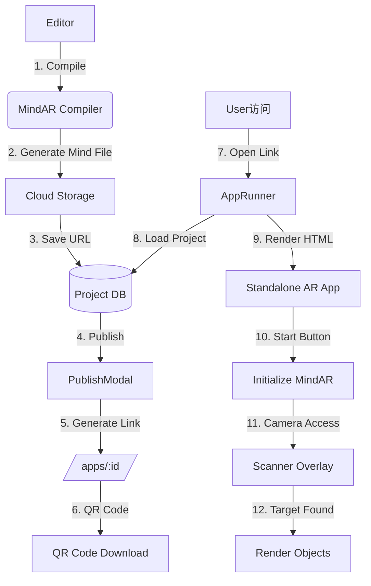
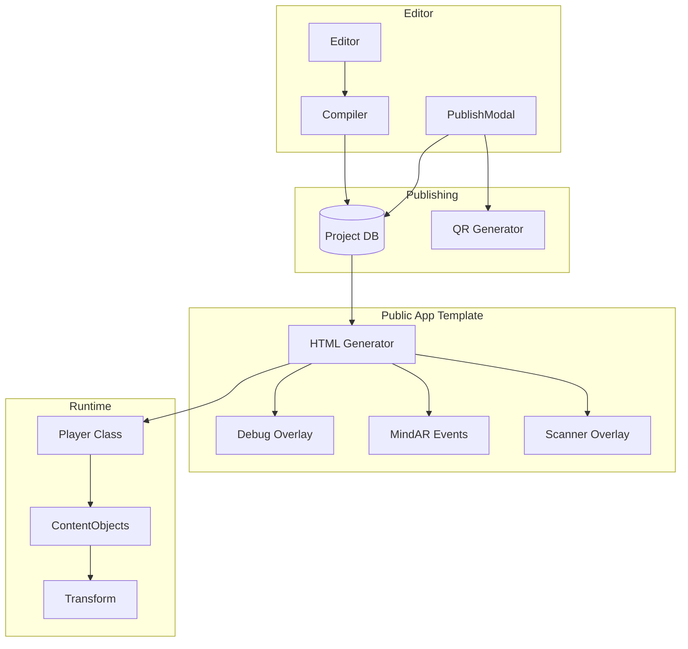

# Publishing Pipeline Improvement Plan - Mirroring Pictarize Architecture

## Executive Summary

This document outlines the improvements needed to mirror the Pictarize publishing architecture while adding new features requested:
- Remove Download option (ZIP)
- Published projects as standalone web apps in `/apps/[project-name]/` folder
- Publicly accessible via shared link and QR code (downloadable)
- Camera access with proper flow: Load → Start Experience → MindAR Scanner
- Debug overlay with MindAR events and library loading data

---

## Current Architecture Analysis

### What's Working ✅

| Component | Location | Status |
|-----------|----------|--------|
| MindAR Compiler | [`utils/compiler.ts`](utils/compiler.ts:1) | Working |
| Publish Modal | [`components/editor/PublishModal.tsx`](components/editor/PublishModal.tsx:1) | Functional |
| App Runner | [`src/pages/AppRunner.tsx`](src/pages/AppRunner.tsx:1) | Serves published apps |
| HTML Generator | [`utils/exportUtils.ts`](utils/exportUtils.ts:237) | Generates standalone HTML |
| QR Code Generation | [`PublishModal.tsx`](components/editor/PublishModal.tsx:85) | Works |
| Runtime Player | [`components/editor/runtime/Player.ts`](components/editor/runtime/Player.ts:59) | Mirrors refcode |

### Gaps Identified ❌

| Gap | Impact | Priority |
|-----|--------|----------|
| No debug overlay in published apps | Cannot troubleshoot MindAR issues | HIGH |
| Download ZIP option exists | Should be removed per requirements | HIGH |
| Published apps in iframe | Should be standalone HTML pages | HIGH |
| No MindAR event logging | Can't track tracking status | MEDIUM |
| Scanner overlay not visible | User confusion on what to do | MEDIUM |
| All objects may not render correctly | Content not displaying properly | HIGH |

---

## Target Architecture

### Publishing Flow Diagram



### Published App Structure

```
/apps/[project-name]/
├── index.html          # Main standalone app
├── assets/            # Media assets
│   ├── [content-id].jpg
│   ├── [content-id].mp4
│   └── [content-id].glb
└── targets.mind       # Compiled MindAR file
```

---

## Implementation Plan

### Phase 1: PublishModal Improvements (HIGH Priority)

#### 1.1 Remove Download ZIP Option
**File:** [`components/editor/PublishModal.tsx`](components/editor/PublishModal.tsx:101)

```diff
- const handleDownloadZip = async () => { ... }
- <button onClick={handleDownloadZip}>Download ZIP</button>
```

#### 1.2 Improve QR Code Section
- Add "Download QR Code" button (save as PNG)
- Make QR code larger
- Add "Copy Link" button

#### 1.3 Add Project Name to URL
- Change from `/apps/${project.id}` to `/apps/${project.name.toLowerCase().replace(/\s+/g, '-')}`

---

### Phase 2: AppRunner Improvements (HIGH Priority)

#### 2.1 Add Debug Overlay Component
**File:** [`src/pages/AppRunner.tsx`](src/pages/AppRunner.tsx:1)

Create a debug overlay that shows:
- MindAR library loading status
- MindAR events (targetFound, targetLost, error)
- Camera status
- FPS counter
- Memory usage (if available)

```typescript
interface DebugState {
  mindarLoaded: boolean;
  mindarLoading: boolean;
  mindarError: string | null;
  cameraReady: boolean;
  targetsFound: number[];
  lastEvent: string;
  fps: number;
}
```

#### 2.2 Remove Iframe Wrapper
Instead of rendering in an iframe, serve a direct HTML page for better performance and proper camera access.

---

### Phase 3: Published App Template (HIGH Priority)

#### 3.1 Enhance HTML Generator with Debug Overlay
**File:** [`utils/exportUtils.ts`](utils/exportUtils.ts:233)

Add debug overlay to the generated HTML:

```javascript
class DebugOverlay {
    constructor() {
        this.element = document.createElement('div');
        this.element.id = 'debug-overlay';
        // Styles for positioning and visibility
    }
    
    update(state) {
        // Update debug information
    }
}
```

#### 3.2 MindAR Event Listeners

Add comprehensive event tracking:

```javascript
// MindAR Events to Track
const MINDAR_EVENTS = {
    'arReady': 'AR System Ready',
    'arError': 'AR Error',
    'targetFound': 'Target Detected',
    'targetLost': 'Target Lost',
    'cameraReady': 'Camera Ready',
    'loadingProgress': 'Loading Progress'
};
```

#### 3.3 Scanner Overlay

Ensure MindAR's built-in scanner UI is visible:

```javascript
const mindarThree = new MindARThree({
    imageTargetSrc: mindFileUrl,
    uiLoading: "yes",
    uiScanning: "yes",  // Show scanner overlay
    uiError: "yes"
});
```

---

### Phase 4: Object Rendering Fixes (HIGH Priority)

#### 4.1 Review Content Object Classes

Ensure all content types render correctly:

| Content Type | Status | Fixes Needed |
|--------------|--------|--------------|
| Image | Working | None |
| Video | Working | Check chromaKey shader |
| Audio | Working | None |
| Model (GLB) | Working | Check animations |
| Text | Working | None |
| Embed | Partial | CSS3D rendering |

#### 4.2 Transform Correction

The refcode uses a specific correction group:

```javascript
// Correction Group (Scale 0.1, Rot X 90)
this.correctionGroup = new THREE.Group();
this.correctionGroup.scale.set(0.1, 0.1, 0.1);
this.correctionGroup.rotation.set(Math.PI / 2, 0, 0);
```

Ensure this is applied to all content objects in the published app.

---

## File Changes Summary

| File | Changes |
|------|---------|
| [`components/editor/PublishModal.tsx`](components/editor/PublishModal.tsx:1) | Remove download, improve QR code, use project name in URL |
| [`src/pages/AppRunner.tsx`](src/pages/AppRunner.tsx:1) | Add debug overlay, remove iframe |
| [`utils/exportUtils.ts`](utils/exportUtils.ts:233) | Add debug overlay to generated HTML |
| [`src/App.tsx`](src/App.tsx:1) | Update route to use project name |

---

## Mermaid: New Publishing Architecture



---

## User Experience Flow

### Current (Problematic)
```
1. Open published link
2. See loading spinner
3. App appears in iframe
4. MindAR scanner may or may not show
5. Confusing for users
```

### Target (Improved)
```
1. Open published link (/apps/project-name)
2. See "Loading..." with progress
3. See "Start Experience" button
4. Click button → Camera permission requested
5. MindAR scanner overlay appears
6. Point at target → Objects render
7. Debug overlay shows all events (toggleable)
```

---

## Debug Overlay Specification

### Visual Design
- Position: Top-right corner
- Default: Hidden (toggle with button)
- Background: Semi-transparent black
- Text: Green/White monospace
- Font size: 12px

### Data to Display
```
┌─ MindAR Debug ─────────────────┐
│ Library: ✅ Loaded             │
│ Camera:  ✅ Ready              │
│ Mind File: ✅ Loaded           │
│                                │
│ Events:                        │
│ [14:32:15] targetFound: 0      │
│ [14:32:18] targetFound: 1      │
│ [14:32:25] targetLost: 0       │
│                                │
│ FPS: 60                        │
│ Targets: 2/2 found              │
└────────────────────────────────┘
```

---

## Next Steps

1. **Approve this plan** - Review and confirm direction
2. **Phase 1** - Update PublishModal (remove download, improve UX)
3. **Phase 2** - Add debug overlay to AppRunner
4. **Phase 3** - Enhance HTML generator with debug overlay
5. **Phase 4** - Test all object rendering in published apps

---

*Plan created: 2026-02-22*
*Reference: Pictarize refcode and current papar-studio implementation*
