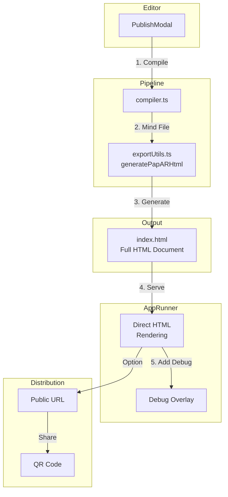

# AR Experience Publishing - Standalone App Generation Plan

## Executive Summary

This plan addresses generating a **standalone AR experience app** that:
- Can be executed independently from the published URL
- Uses a proper **folder-based layout** for the published project files
- Keeps assets as external URLs (no duplication of content)

---

## Current Architecture Analysis

### What's Working
| Component | Status | Purpose |
|-----------|--------|---------|
| MindAR Compiler | ✅ | Compiles target images to `.mind` file |
| PublishModal | ✅ | Handles publishing flow, compiles targets |
| AppRunner | ❌ | Renders app in iframe - **needs to be fixed** |
| `generateAFrameHtml` | ✅ | Generates embedded AR HTML |

### Identified Issues

1. **Function Naming**: `generateAFrameHtml` is misleading - should be `generatePapARHtml`
2. **Iframe Rendering**: AppRunner uses iframe which causes:
   - Camera permission problems in some browsers
   - Not a proper standalone document
   - Limited styling and script capabilities
3. **Not Truly Standalone**: Published apps cannot be distributed independently

---

## Target Architecture

### Function Renaming

**Current:** `generateAFrameHtml`  
**New:** `generatePapARHtml`

The function generates HTML using:
- Three.js (3D rendering)
- MindAR (AR tracking)
- CSS3DRenderer (for DOM overlay)

### AppRunner Architecture Change

**Current (Problematic):**
```tsx
// AppRunner.tsx - uses iframe
<iframe srcDoc={html} ... />
```

**Target (Fixed):**
```tsx
// AppRunner.tsx - direct HTML rendering
<div dangerouslySetInnerHTML={{ __html: html }} />
```

Or better - serve the generated HTML as a static file.

### Published App Folder Structure

```
/apps/[project-slug]/
├── index.html              # Main standalone AR app
├── project.json            # Project data for runtime loading
├── mindar/
│   ├── targets.mind       # Compiled MindAR file
│   └── targets/            # Target marker images
│       └── target_0.jpg
└── scripts/
    └── target_0.json      # Compiled script (optional)
```

---

## Implementation Plan

### Phase 1: Rename Function

#### 1.1 Rename `generateAFrameHtml` to `generatePapARHtml`

**File:** `utils/exportUtils.ts`

**Changes:**
- Rename function from `generateAFrameHtml` to `generatePapARHtml`
- Update all function references

```typescript
// Before:
export const generateAFrameHtml = (project, localAssetMap?, mindFileUrl?, enableDebug?): string => { }

// After:
export const generatePapARHtml = (project, localAssetMap?, mindFileUrl?, enableDebug?): string => { }
```

#### 1.2 Update References

**Files to update:**
- `utils/exportUtils.ts` - function definition
- `src/pages/AppRunner.tsx` - imports and usage

---

### Phase 2: Fix AppRunner - Remove Iframe

#### 2.1 Replace Iframe with Direct Rendering

**File:** `src/pages/AppRunner.tsx`

**Current implementation (problematic):**
```tsx
<iframe
  srcDoc={html}
  title="AR Experience"
  style={{ width: '100vw', height: '100vh', border: 'none' }}
  sandbox="allow-scripts allow-popups allow-forms allow-same-origin"
/>
```

**New implementation:**
```tsx
// Option 1: Direct HTML injection
<div 
  dangerouslySetInnerHTML={{ __html: html }} 
  style={{ width: '100vw', height: '100vh' }}
/>

// Option 2: Static file serving (recommended for production)
// Serve from /public/apps/[slug]/index.html
```

**Benefits:**
- Proper full-page rendering
- No iframe sandbox restrictions
- Full access to camera APIs
- Proper CSS styling
- Better browser compatibility

#### 2.2 Add Proper Debug Overlay

Since we're no longer in an iframe, the debug overlay needs to be integrated differently:

**Option A:** Include debug overlay in generated HTML (from generatePapARHtml)
**Option B:** Render debug as sibling element in AppRunner

---

### Phase 3: Update Generated HTML

#### 3.1 Enhance `generatePapARHtml` Output

The generated HTML should be a complete, standalone document:

```html
<!DOCTYPE html>
<html lang="en">
<head>
  <meta charset="UTF-8">
  <meta name="viewport" content="width=device-width, initial-scale=1.0">
  <title>Project Name</title>
  <style>
    /* All styles inline */
  </style>
</head>
<body>
  <!-- AR Container -->
  <!-- Scripts -->
</body>
</html>
```

#### 3.2 Ensure Proper Styling

- All CSS should be included inline in the generated HTML
- No external CSS dependencies
- Self-contained document

---

## File Changes Summary

| File | Changes | Priority |
|------|---------|----------|
| `utils/exportUtils.ts` | Rename `generateAFrameHtml` → `generatePapARHtml` | HIGH |
| `src/pages/AppRunner.tsx` | Remove iframe, use direct HTML rendering | HIGH |
| `components/editor/PublishModal.tsx` | Remove download features | HIGH |

---

## Detailed Implementation Steps

### Step 1: Rename Function

**File:** `utils/exportUtils.ts`

```typescript
// Line 294: Rename this function
// Before:
export const generateAFrameHtml = (project, localAssetMap?, mindFileUrl?, enableDebug?): string => { }

// After:
export const generatePapARHtml = (project, localAssetMap?, mindFileUrl?, enableDebug?): string => { }
```

**Also update:**
- Export statement at bottom of file
- JSDoc comment to reflect "PapAR" branding

### Step 2: Fix AppRunner

**File:** `src/pages/AppRunner.tsx`

**Update imports:**
```typescript
// Line 5: Update import
// Before:
import { generateAFrameHtml } from '../../utils/exportUtils';

// After:
import { generatePapARHtml } from '../../utils/exportUtils';
```

**Replace iframe with direct rendering:**
```tsx
// Around line 267: Replace iframe with:
{/* Direct HTML rendering - no iframe */}
<div 
  dangerouslySetInnerHTML={{ __html: html }} 
  className="w-screen h-screen overflow-hidden"
  style={{ width: '100vw', height: '100vh' }}
/>
```

**Keep debug overlay** as a sibling element:
```tsx
{/* Debug Overlay - rendered as sibling, not in iframe */}
{showDebug && (
  <div className="debug-overlay...">...</div>
)}
```

### Step 3: Remove Download Features

**File:** `components/editor/PublishModal.tsx`

Remove any download ZIP or download HTML functionality:
- Remove `handleDownloadZip` function
- Remove download buttons from UI

---

## Success Criteria

- [ ] Function renamed from `generateAFrameHtml` to `generatePapARHtml`
- [ ] All references updated in codebase
- [ ] AppRunner no longer uses iframe
- [ ] Published app renders as proper HTML document
- [ ] Camera access works reliably in published apps
- [ ] Download features removed from PublishModal

---

## Mermaid: Publishing Flow



---

## Risks and Mitigations

| Risk | Impact | Mitigation |
|------|--------|------------|
| Breaking existing references | App breaks | Update all references before deployment |
| HTML injection security | XSS vulnerabilities | Sanitize if needed |
| Debug overlay positioning | May not work properly | Test and adjust positioning |

---

## Next Steps

1. **Approve this plan** - Confirm direction
2. **Implement Phase 1** - Rename function to `generatePapARHtml`
3. **Implement Phase 2** - Fix AppRunner to remove iframe
4. **Implement Phase 3** - Remove download features
5. **Test** - Verify published apps work correctly
6. **Deploy** - Release update to users

---

*Plan created: 2026-03-03*
*Project: papar-studio*
*Last updated: 2026-03-03 (v3 - renamed to PapAR, removed iframe, removed downloads)*
