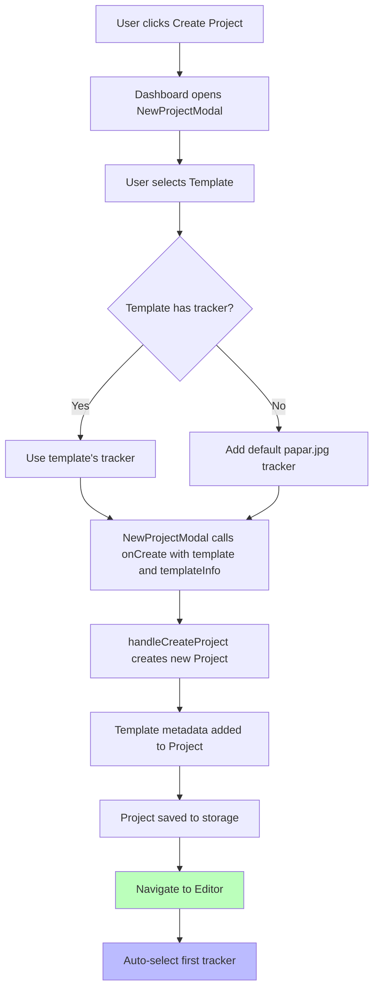
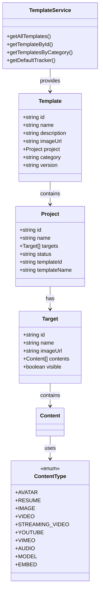

# Template System Implementation Plan

## Executive Summary

This plan outlines the restructuring of the project's template system to properly separate templates into individual project files, create a unified template loading mechanism, and ensure consistent handling of both template-based and blank projects throughout the editor and publishing pipeline. Key additions include default image tracker support from papar.jpg, auto-selection of the first tracker on project load, Pictarize Studio compatibility for content types, and reconstruction of template data from available sources.

## Current State Analysis

### Existing Template Structure

The codebase currently defines templates in `data/mockData.ts` with these templates:

1. **Blank Project** - Empty project with no targets or contents
2. **Slideshow** - Currently references blank project (INCOMPLETE)
3. **Flash Cards** - Currently references blank project (INCOMPLETE)
4. **Performance** - Currently references blank project (INCOMPLETE)
5. **Business Card** - Complete with demo script and sample content
6. **Animated Models** - Currently references blank project (INCOMPLETE)

### Template Data Reconstruction

Based on analysis of available sources (refcode folder in papar-studio8):

| Template | Status | Data Source |
|----------|--------|-------------|
| Blank Project | INCOMPLETE - Needs default tracker | Will create from papar.jpg |
| Business Card | COMPLETE | data/mockData.ts |
| Slideshow | INCOMPLETE | Will use default tracker |
| Flash Cards | INCOMPLETE | Will use default tracker |
| Performance | INCOMPLETE | Will use default tracker |
| Animated Models | INCOMPLETE | Will use default tracker |

**Note**: Templates marked as "blank/have no data" (Slideshow, Flash Cards, Performance, Animated Models) will be reconstructed using the default papar.jpg tracker.

### Current Issues

1. **Templates are not separated**: All templates are in a single file with most having incomplete project definitions
2. **Duplicate mock data**: Both `data/mockData.ts` and `src/data/mockData.ts` exist
3. **Inconsistent project creation**: Template projects are cloned but template metadata is lost
4. **Publishing doesn't preserve template info**: No tracking of which template a project was created from
5. **Hardcoded template loading**: Templates are static, no dynamic loading capability
6. **No default tracker**: Blank projects have no default image target
7. **Tracker auto-selection missing**: First tracker not automatically selected on project load

### Key Files to Modify

| File | Purpose |
|------|---------|
| `types.ts` | Add template metadata to Project type, update ContentType for Pictarize Studio |
| `data/mockData.ts` | Add default tracker definition, update templates |
| `src/data/mockData.ts` | Remove duplicate |
| `src/services/projectService.ts` | Add template loading functions, default tracker handling |
| `src/pages/Dashboard.tsx` | Use new template system |
| `components/dashboard/NewProjectModal.tsx` | Update for template selection |
| `components/editor/Editor.tsx` | Auto-select first tracker on load |
| `components/editor/ScenePanel.tsx` | Handle default tracker selection |
| `components/editor/PublishModal.tsx` | Handle template-based projects |

---

## Implementation Plan

### Phase 1: Type System Updates

#### 1.1 Update Project Type
Add template metadata to track which template a project was created from:

```typescript
// In types.ts
export interface Project {
  id: string;
  name: string;
  targets: Target[];
  assets?: Asset[];
  mindARConfig?: MindARConfig;
  lastUpdated: string;
  status: 'Draft' | 'Published';
  sizeMB: number;
  publishedSlug?: string;
  // NEW: Template metadata
  templateId?: string;      // ID of template used to create this project
  templateName?: string;    // Human-readable template name
}
```

#### 1.2 Update Template Type
Add version tracking and improve metadata:

```typescript
export interface Template {
    id: string;
    name: string;
    description: string;
    imageUrl: string;
    project: Project;
    version?: string;        // Template version for migrations
    category?: string;        // e.g., 'business', 'education', 'entertainment'
}
```

#### 1.3 Update ContentType for Pictarize Studio Compatibility
Add streaming-video type and ensure all content types align with Pictarize Studio:

```typescript
export enum ContentType {
  AVATAR = 'avatar',
  RESUME = 'resume',
  ICON_FACEBOOK = 'icon-facebook',
  ICON_EMAIL = 'icon-email',
  ICON_YOUTUBE = 'icon-youtube',
  ICON_WEBSITE = 'icon-website',
  TEXT = 'text',
  IMAGE = 'image',
  VIDEO = 'video',
  STREAMING_VIDEO = 'streaming-video',  // Added for Pictarize Studio compatibility
  YOUTUBE = 'youtube',                  // Added for Pictarize Studio compatibility
  VIMEO = 'vimeo',                      // Added for Pictarize Studio compatibility
  AUDIO = 'audio',
  MODEL = 'model',
  EMBED = 'embed',                       // Added for Pictarize Studio compatibility
}
```

#### 1.4 Update Content Properties for Pictarize Studio
Add missing content properties used by Pictarize Studio:

```typescript
export interface Content {
  id: string;
  name: string;
  type: ContentType;
  transform: Transform;
  alwaysFacingUser?: boolean;
  visible?: boolean;
  // Text specific
  color?: string;
  outlineColor?: string;
  outlineWidth?: number;
  font?: string;
  style?: 'normal' | 'italic';
  weight?: 'normal' | 'bold';
  size?: number;
  align?: 'left' | 'center' | 'right';
  textContent?: string;
  // Image specific
  imageUrl?: string;
  // Video/Audio specific
  videoUrl?: string;
  audioUrl?: string;
  autoplay?: boolean;
  loop?: boolean;
  muted?: boolean;
  streamingService?: 'youtube' | 'vimeo'; // Explicit service selector
  videoClickToggle?: boolean; // Toggle play/pause on click
  videoControls?: boolean; // Show playback controls
  videoFullScreen?: boolean; // Allow fullscreen
  chromaKey?: boolean;
  chromaColor?: string;
  // Model specific
  modelUrl?: string;
  animateAutostart?: boolean;
  animateLoop?: 'once' | 'repeat' | 'pingpong';
  textureOverrides?: Record<string, string>;
  materialOverrides?: Record<string, MaterialProperties>;
  materialNames?: string[];
  // NEW: Pictarize Studio properties
  embedUrl?: string;                    // For EMBED content type
  aspectRatio?: string;                  // e.g., '16:9', '4:3'
  fitMode?: 'cover' | 'contain' | 'fill';
  opacity?: number;
  animationIn?: string;                 // Entry animation
  animationOut?: string;                // Exit animation
  delay?: number;                        // Animation delay in ms
  duration?: number;                    // Animation duration in ms
}
```

#### 1.5 Update Asset Type for Pictarize Studio Compatibility
Unify asset types as content types:

```typescript
export interface Asset {
    id: string;
    name: string;
    type: 'image' | 'video' | 'audio' | 'model' | 'mind' | 'script' | 'embed';
    url: string;
    thumbnail?: string;
    // NEW: Pictarize Studio properties
    contentType?: ContentType;           // Link to ContentType for compatibility
    metadata?: Record<string, unknown>;  // Additional metadata
}
```

---

### Phase 2: Default Image Tracker

#### 2.1 Create Default Tracker Definition
Add default tracker using papar.jpg from public folder:

```typescript
// In data/mockData.ts or new file
import { Target, Content, ContentType } from '../types';

export const DEFAULT_IMAGE_TRACKER_PATH = '/papar.jpg';

export const defaultTracker: Target = {
  id: 'target_default',
  name: 'Papar Studio Tracker',
  imageUrl: DEFAULT_IMAGE_TRACKER_PATH,
  visible: true,
  contents: [],  // Empty by default, users can add content
  script: undefined,
};
```

#### 2.2 Update Blank Project Template
Modify blank template to include default tracker:

```typescript
const BLANK_PROJECT_TEMPLATE: Project = {
    id: 'template_blank',
    name: 'Blank Project',
    targets: [defaultTracker],  // ADDED: Default papar.jpg tracker
    lastUpdated: '',
    status: 'Draft',
    sizeMB: 0.1
};
```

#### 2.3 Update All Incomplete Templates
Apply default tracker to templates without data:

```typescript
// Templates to update with default tracker:
// - Slideshow
// - Flash Cards
// - Performance
// - Animated Models

const SLIDESHOW_PROJECT_TEMPLATE: Project = {
    id: 'template_slideshow',
    name: 'Slideshow',
    targets: [defaultTracker],
    // Add slideshow-specific content if available
    lastUpdated: '',
    status: 'Draft',
    sizeMB: 0.1
};

// Similar for Flash Cards, Performance, Animated Models
```

---

### Phase 3: Auto-Select First Tracker

#### 3.1 Update Editor Component
Auto-select first tracker when project loads:

```typescript
// In components/editor/Editor.tsx
useEffect(() => {
  if (project && project.targets.length > 0) {
    // Auto-select first tracker
    const firstTracker = project.targets[0];
    setSelectedTarget(firstTracker.id);
  }
}, [project]);
```

#### 3.2 Update ScenePanel Component
Ensure first tracker is visible in scene:

```typescript
// In components/editor/ScenePanel.tsx
useEffect(() => {
  if (targets.length > 0 && !selectedTargetId) {
    // Auto-select first target for visibility
    handleSelectTarget(targets[0].id);
  }
}, [targets, selectedTargetId]);
```

---

### Phase 4: Create Templates Folder

#### 4.1 Create Template Files Structure
```
templates/
├── index.ts              # Template loader/exports
├── blank.ts              # Blank project template with default tracker
├── business-card.ts     # Business card template (from mockData)
├── slideshow.ts          # Slideshow template with default tracker
├── flash-cards.ts       # Flash cards template with default tracker
├── performance.ts        # Performance template with default tracker
└── animated-models.ts   # Animated models template with default tracker
```

#### 4.2 Template File Format
Each template file exports a Template object:

```typescript
// templates/blank.ts
import { Template } from '../types';
import { defaultTracker } from '../data/mockData';

export const blankTemplate: Template = {
    id: 'tpl_blank',
    name: 'Blank Project',
    description: 'Start with an empty project',
    imageUrl: 'https://picsum.photos/seed/blank/200/120',
    category: 'basic',
    project: {
        id: 'template_blank',
        name: 'Blank Project',
        targets: [defaultTracker],  // Uses default papar.jpg tracker
        lastUpdated: '',
        status: 'Draft',
        sizeMB: 0.1
    }
};
```

---

### Phase 5: Template Loading Service

#### 5.1 Create Template Loader
Create `src/services/templateService.ts`:

```typescript
import { Template } from '../../types';
import { blankTemplate } from '../../templates/blank';
import { businessCardTemplate } from '../../templates/business-card';
import { slideshowTemplate } from '../../templates/slideshow';
import { flashCardsTemplate } from '../../templates/flash-cards';
import { performanceTemplate } from '../../templates/performance';
import { animatedModelsTemplate } from '../../templates/animated-models';

const TEMPLATES: Template[] = [
    blankTemplate,
    businessCardTemplate,
    slideshowTemplate,
    flashCardsTemplate,
    performanceTemplate,
    animatedModelsTemplate,
];

export const getAllTemplates = (): Template[] => TEMPLATES;

export const getTemplateById = (id: string): Template | undefined => 
    TEMPLATES.find(t => t.id === id);

export const getTemplatesByCategory = (category: string): Template[] =>
    TEMPLATES.filter(t => t.category === category);

export const getDefaultTracker = () => defaultTracker;
```

---

### Phase 6: Dashboard Updates

#### 6.1 Update Dashboard to Use Template Service
Modify `src/pages/Dashboard.tsx`:

```typescript
// Replace MOCK_TEMPLATES import with template service
import { getAllTemplates } from '../services/templateService';

// In component:
const templates = getAllTemplates();
```

#### 6.2 Update Project Creation
Modify `handleCreateProject` to preserve template metadata:

```typescript
const handleCreateProject = useCallback((template: Project, templateInfo?: { id: string; name: string }) => {
    const newProject: Project = {
      ...template,
      id: `proj_${Date.now()}`,
      name: template.name === 'Blank Project' ? 'Untitled Project' : `${template.name} Clone`,
      lastUpdated: new Date().toLocaleString(),
      status: 'Draft',
      // Preserve template metadata
      templateId: templateInfo?.id,
      templateName: templateInfo?.name,
      // Ensure default tracker is included for blank projects
      targets: template.targets.length > 0 ? template.targets : [defaultTracker],
    };
    // ... rest of function
}, [projects, navigate]);
```

---

### Phase 7: NewProjectModal Updates

#### 7.1 Pass Template Info to onCreate
Modify `NewProjectModal` to pass full template info:

```typescript
interface NewProjectModalProps {
  templates: Template[];
  onClose: () => void;
  onCreate: (project: Project, templateInfo: { id: string; name: string }) => void;
}

// In the onClick handler:
onClick={() => onCreate(template.project, { id: template.id, name: template.name })}
```

---

### Phase 8: Editor Updates

#### 8.1 Display Template Info in Editor
Modify `Header.tsx` to show template origin:

```typescript
// In the project info section, display:
// "Created from: {project.templateName || 'Custom'}"
```

#### 8.2 Handle Default Tracker Selection
Ensure first tracker is selected and visible:

```typescript
// In Editor initialization
const initializeEditor = useCallback((project: Project) => {
  // If no targets, add default tracker
  if (project.targets.length === 0) {
    project.targets = [defaultTracker];
  }
  
  // Auto-select first target
  if (!selectedTargetId && project.targets.length > 0) {
    setSelectedTargetId(project.targets[0].id);
  }
}, [selectedTargetId]);
```

---

### Phase 9: Publishing Updates

#### 9.1 Update PublishModal for Template Projects
Ensure template-based projects are published consistently:

```typescript
// When publishing, log template info for analytics
const handleCompile = async () => {
    // ... existing compile logic
    
    // Add template context to publishing metadata
    const publishMetadata = {
        projectId: project.id,
        projectName: project.name,
        templateId: project.templateId,
        templateName: project.templateName,
        hasDefaultTracker: project.targets.some(t => t.id === 'target_default'),
        // ... other metadata
    };
    
    // Log or store template context
    console.log('Publishing project:', publishMetadata);
};
```

---

### Phase 10: Cleanup

#### 10.1 Remove Duplicate Files
- Delete `src/data/mockData.ts` (keep `data/mockData.ts` for now as it's referenced)

#### 10.2 Update Imports
Ensure all components import templates from the new service.

---

## Mermaid Diagram: Project Creation Flow


```mermaid
flowchart TD
    A[User clicks Create Project] --> B[Dashboard opens NewProjectModal]
    B --> C[User selects Template]
    C --> D{Template has tracker?}
    D -->|Yes| E[Use template's tracker]
    D -->|No| F[Add default papar.jpg tracker]
    E --> G[NewProjectModal calls onCreate with template and templateInfo]
    F --> G
    G --> H[handleCreateProject creates new Project]
    H --> I[Template metadata added to Project]
    I --> J[Project saved to storage]
    J --> K[Navigate to Editor]
    K --> L[Auto-select first tracker]
    
    style L fill:#bbf
    style K fill:#bfb
```

---

## Mermaid Diagram: Template System Architecture


```mermaid
classDiagram
    class Template {
        +string id
        +string name
        +string description
        +string imageUrl
        +Project project
        +string category
        +string version
    }
    
    class Project {
        +string id
        +string name
        +Target[] targets
        +string status
        +string templateId
        +string templateName
    }
    
    class Target {
        +string id
        +string name
        +string imageUrl
        +Content[] contents
        +boolean visible
    }
    
    class ContentType {
        <<enum>>
        +AVATAR
        +RESUME
        +IMAGE
        +VIDEO
        +STREAMING_VIDEO
        +YOUTUBE
        +VIMEO
        +AUDIO
        +MODEL
        +EMBED
    }
    
    Template --> Project : contains
    Project --> Target : has
    Target --> Content : contains
    Content --> ContentType : uses
    
    class TemplateService {
        +getAllTemplates()
        +getTemplateById()
        +getTemplatesByCategory()
        +getDefaultTracker()
    }
    
    TemplateService --> Template : provides
```

---

## Implementation Order

1. **Update types.ts** - Add template metadata fields, update ContentType for Pictarize Studio
2. **Update data/mockData.ts** - Add default tracker definition, update all templates
3. **Create templates/ folder** - Create individual template files
4. **Create templateService.ts** - Build template loading service
5. **Update Editor.tsx** - Auto-select first tracker on project load
6. **Update ScenePanel.tsx** - Handle default tracker selection
7. **Update Dashboard.tsx** - Use template service and pass template info
8. **Update NewProjectModal.tsx** - Pass template info on creation
9. **Update Header.tsx** - Display template origin
10. **Update PublishModal.tsx** - Handle template projects consistently
11. **Clean up** - Remove duplicates and unused code

---

## Backward Compatibility

- Existing projects without `templateId` will display as "Custom" in the editor
- Publishing continues to work for both template-based and custom projects
- Template version field allows future migrations of template content
- Default tracker is only added to NEW blank projects, not existing ones
- Content types remain backward compatible with existing content

---

## Default Tracker Specification

### papar.jpg Tracker Configuration

```typescript
const DEFAULT_TRACKER_CONFIG = {
  id: 'target_default',
  name: 'Papar Studio Tracker',
  imageUrl: '/papar.jpg',  // Located in public/papar.jpg
  visible: true,
  contents: [],
  mindFileUrl: undefined,  // Will be generated on compile
};
```

### Tracker Auto-Selection Behavior

1. When a project loads, check if it has any targets
2. If targets exist, auto-select the first one (index 0)
3. If no targets exist, add the default papar.jpg tracker and select it
4. The selected tracker should be visible in the scene preview

---

## Pictarize Studio Compatibility

### Content Type Mapping

| Current Type | Pictarize Studio Type | Notes |
|--------------|----------------------|-------|
| IMAGE | image | Direct mapping |
| VIDEO | video | Direct mapping |
| STREAMING_VIDEO | streaming-video | Added for streaming services |
| YOUTUBE | youtube | Added for YouTube embeds |
| VIMEO | vimeo | Added for Vimeo embeds |
| AUDIO | audio | Direct mapping |
| MODEL | model | Direct mapping |
| TEXT | text | Direct mapping |
| EMBED | embed | Added for generic embeds |

### Content Properties Alignment

The following properties have been added to align with Pictarize Studio:

- `streamingService`: Explicitly specify YouTube or Vimeo
- `videoFullScreen`: Fullscreen toggle
- `aspectRatio`: Video/image aspect ratio
- `fitMode`: Object fit mode (cover/contain/fill)
- `opacity`: Opacity control
- `animationIn`: Entry animations
- `animationOut`: Exit animations
- `delay`: Animation delay
- `duration`: Animation duration
- `embedUrl`: For EMBED content type
- `contentType`: Asset to ContentType linking
- `metadata`: Additional asset metadata
