```mermaid
flowchart TD
    A[User clicks Create Project] --> B[Dashboard opens NewProjectModal]
    B --> C[User selects Template]
    C --> D[NewProjectModal calls onCreate with template and templateInfo]
    D --> E[handleCreateProject creates new Project]
    E --> F[Template metadata added to Project]
    F --> G[Project saved to storage]
    G --> H[Navigate to Editor]
    
    style F fill:#bbf
    style H fill:#bfb
```

# Template System Implementation Plan

## Executive Summary

This plan outlines the restructuring of the project's template system to properly separate templates into individual project files, create a unified template loading mechanism, and ensure consistent handling of both template-based and blank projects throughout the editor and publishing pipeline.

## Current State Analysis

### Existing Template Structure

The codebase currently defines templates in `data/mockData.ts` with these templates:

1. **Blank Project** - Empty project with no targets or contents
2. **Slideshow** - Currently references blank project (INCOMPLETE)
3. **Flash Cards** - Currently references blank project (INCOMPLETE)
4. **Performance** - Currently references blank project (INCOMPLETE)
5. **Business Card** - Complete with demo script and sample content
6. **Animated Models** - Currently references blank project (INCOMPLETE)

### Current Issues

1. **Templates are not separated**: All templates are in a single file with most having incomplete project definitions
2. **Duplicate mock data**: Both `data/mockData.ts` and `src/data/mockData.ts` exist
3. **Inconsistent project creation**: Template projects are cloned but template metadata is lost
4. **Publishing doesn't preserve template info**: No tracking of which template a project was created from
5. **Hardcoded template loading**: Templates are static, no dynamic loading capability

### Key Files to Modify

| File | Purpose |
|------|---------|
| `types.ts` | Add template metadata to Project type |
| `data/mockData.ts` | Clean up and create template loader |
| `src/data/mockData.ts` | Remove duplicate |
| `src/services/projectService.ts` | Add template loading functions |
| `src/pages/Dashboard.tsx` | Use new template system |
| `components/dashboard/NewProjectModal.tsx` | Update for template selection |
| `components/editor/PublishModal.tsx` | Handle template-based projects |

---

## Implementation Plan

### Phase 1: Type System Updates

#### 1.1 Update Project Type
Add template metadata to track which template a project was created from:

```typescript
// In types.ts
export interface Project {
  id: string;
  name: string;
  targets: Target[];
  assets?: Asset[];
  mindARConfig?: MindARConfig;
  lastUpdated: string;
  status: 'Draft' | 'Published';
  sizeMB: number;
  publishedSlug?: string;
  // NEW: Template metadata
  templateId?: string;      // ID of template used to create this project
  templateName?: string;    // Human-readable template name
}
```

#### 1.2 Update Template Type
Add version tracking and improve metadata:

```typescript
export interface Template {
    id: string;
    name: string;
    description: string;
    imageUrl: string;
    project: Project;
    version?: string;        // Template version for migrations
    category?: string;        // e.g., 'business', 'education', 'entertainment'
}
```

---

### Phase 2: Create Templates Folder

#### 2.1 Create Template Files Structure
```
templates/
├── index.ts              # Template loader/exports
├── blank.ts              # Blank project template
├── business-card.ts     # Business card template
├── slideshow.ts          # Slideshow template
├── flash-cards.ts       # Flash cards template
├── performance.ts        # Performance template
└── animated-models.ts   # Animated models template
```

#### 2.2 Template File Format
Each template file exports a Template object:

```typescript
// templates/blank.ts
import { Template } from '../types';

export const blankTemplate: Template = {
    id: 'tpl_blank',
    name: 'Blank Project',
    description: 'Start with an empty project',
    imageUrl: 'https://picsum.photos/seed/blank/200/120',
    category: 'basic',
    project: {
        id: 'template_blank',
        name: 'Blank Project',
        targets: [],
        lastUpdated: '',
        status: 'Draft',
        sizeMB: 0.1
    }
};
```

---

### Phase 3: Template Loading Service

#### 3.1 Create Template Loader
Create `src/services/templateService.ts`:

```typescript
import { Template } from '../../types';
import { blankTemplate } from '../../templates/blank';
import { businessCardTemplate } from '../../templates/business-card';
// ... import all templates

const TEMPLATES: Template[] = [
    blankTemplate,
    businessCardTemplate,
    // ... all templates
];

export const getAllTemplates = (): Template[] => TEMPLATES;

export const getTemplateById = (id: string): Template | undefined => 
    TEMPLATES.find(t => t.id === id);

export const getTemplatesByCategory = (category: string): Template[] =>
    TEMPLATES.filter(t => t.category === category);
```

---

### Phase 4: Dashboard Updates

#### 4.1 Update Dashboard to Use Template Service
Modify `src/pages/Dashboard.tsx`:

```typescript
// Replace MOCK_TEMPLATES import with template service
import { getAllTemplates } from '../services/templateService';

// In component:
const templates = getAllTemplates();
```

#### 4.2 Update Project Creation
Modify `handleCreateProject` to preserve template metadata:

```typescript
const handleCreateProject = useCallback((template: Project, templateInfo?: { id: string; name: string }) => {
    const newProject: Project = {
      ...template,
      id: `proj_${Date.now()}`,
      name: template.name === 'Blank Project' ? 'Untitled Project' : `${template.name} Clone`,
      lastUpdated: new Date().toLocaleString(),
      status: 'Draft',
      // Preserve template metadata
      templateId: templateInfo?.id,
      templateName: templateInfo?.name,
    };
    // ... rest of function
}, [projects, navigate]);
```

---

### Phase 5: NewProjectModal Updates

#### 5.1 Pass Template Info to onCreate
Modify `NewProjectModal` to pass full template info:

```typescript
interface NewProjectModalProps {
  templates: Template[];
  onClose: () => void;
  onCreate: (project: Project, templateInfo: { id: string; name: string }) => void;
}

// In the onClick handler:
onClick={() => onCreate(template.project, { id: template.id, name: template.name })}
```

---

### Phase 6: Editor Updates

#### 6.1 Display Template Info in Editor
Modify `Header.tsx` to show template origin:

```typescript
// In the project info section, display:
// "Created from: {project.templateName || 'Custom'}"
```

---

### Phase 7: Publishing Updates

#### 7.1 Update PublishModal for Template Projects
Ensure template-based projects are published consistently:

```typescript
// When publishing, log template info for analytics
const handleCompile = async () => {
    // ... existing compile logic
    
    // Add template context to publishing metadata
    const publishMetadata = {
        projectId: project.id,
        projectName: project.name,
        templateId: project.templateId,
        templateName: project.templateName,
        // ... other metadata
    };
    
    // Log or store template context
    console.log('Publishing project:', publishMetadata);
};
```

---

### Phase 8: Cleanup

#### 8.1 Remove Duplicate Files
- Delete `src/data/mockData.ts` (keep `data/mockData.ts` for now as it's referenced)

#### 8.2 Update Imports
Ensure all components import templates from the new service.

---

## Mermaid Diagram: Project Creation Flow


---

## Mermaid Diagram: Template System Architecture


---

## Implementation Order

1. **Update types.ts** - Add template metadata fields
2. **Create templates/ folder** - Create individual template files
3. **Create templateService.ts** - Build template loading service
4. **Update Dashboard.tsx** - Use template service and pass template info
5. **Update NewProjectModal.tsx** - Pass template info on creation
6. **Update Editor components** - Display template origin
7. **Update PublishModal.tsx** - Handle template projects consistently
8. **Clean up** - Remove duplicates and unused code

---

## Backward Compatibility

- Existing projects without `templateId` will display as "Custom" in the editor
- Publishing continues to work for both template-based and custom projects
- Template version field allows future migrations of template content

## Executive Summary

This plan outlines the restructuring of the project's template system to properly separate templates into individual project files, create a unified template loading mechanism, and ensure consistent handling of both template-based and blank projects throughout the editor and publishing pipeline.

## Current State Analysis

### Existing Template Structure

The codebase currently defines templates in `data/mockData.ts` with these templates:

1. **Blank Project** - Empty project with no targets or contents
2. **Slideshow** - Currently references blank project (INCOMPLETE)
3. **Flash Cards** - Currently references blank project (INCOMPLETE)
4. **Performance** - Currently references blank project (INCOMPLETE)
5. **Business Card** - Complete with demo script and sample content
6. **Animated Models** - Currently references blank project (INCOMPLETE)

### Current Issues

1. **Templates are not separated**: All templates are in a single file with most having incomplete project definitions
2. **Duplicate mock data**: Both `data/mockData.ts` and `src/data/mockData.ts` exist
3. **Inconsistent project creation**: Template projects are cloned but template metadata is lost
4. **Publishing doesn't preserve template info**: No tracking of which template a project was created from
5. **Hardcoded template loading**: Templates are static, no dynamic loading capability

### Key Files to Modify

| File | Purpose |
|------|---------|
| `types.ts` | Add template metadata to Project type |
| `data/mockData.ts` | Clean up and create template loader |
| `src/data/mockData.ts` | Remove duplicate |
| `src/services/projectService.ts` | Add template loading functions |
| `src/pages/Dashboard.tsx` | Use new template system |
| `components/dashboard/NewProjectModal.tsx` | Update for template selection |
| `components/editor/PublishModal.tsx` | Handle template-based projects |

---

## Implementation Plan

### Phase 1: Type System Updates

#### 1.1 Update Project Type
Add template metadata to track which template a project was created from:

```typescript
// In types.ts
export interface Project {
  id: string;
  name: string;
  targets: Target[];
  assets?: Asset[];
  mindARConfig?: MindARConfig;
  lastUpdated: string;
  status: 'Draft' | 'Published';
  sizeMB: number;
  publishedSlug?: string;
  // NEW: Template metadata
  templateId?: string;      // ID of template used to create this project
  templateName?: string;    // Human-readable template name
}
```

#### 1.2 Update Template Type
Add version tracking and improve metadata:

```typescript
export interface Template {
    id: string;
    name: string;
    description: string;
    imageUrl: string;
    project: Project;
    version?: string;        // Template version for migrations
    category?: string;        // e.g., 'business', 'education', 'entertainment'
}
```

---

### Phase 2: Create Templates Folder

#### 2.1 Create Template Files Structure
```
templates/
├── index.ts              # Template loader/exports
├── blank.ts              # Blank project template
├── business-card.ts     # Business card template
├── slideshow.ts          # Slideshow template
├── flash-cards.ts       # Flash cards template
├── performance.ts        # Performance template
└── animated-models.ts   # Animated models template
```

#### 2.2 Template File Format
Each template file exports a Template object:

```typescript
// templates/blank.ts
import { Template } from '../types';

export const blankTemplate: Template = {
    id: 'tpl_blank',
    name: 'Blank Project',
    description: 'Start with an empty project',
    imageUrl: 'https://picsum.photos/seed/blank/200/120',
    category: 'basic',
    project: {
        id: 'template_blank',
        name: 'Blank Project',
        targets: [],
        lastUpdated: '',
        status: 'Draft',
        sizeMB: 0.1
    }
};
```

---

### Phase 3: Template Loading Service

#### 3.1 Create Template Loader
Create `src/services/templateService.ts`:

```typescript
import { Template } from '../../types';
import { blankTemplate } from '../../templates/blank';
import { businessCardTemplate } from '../../templates/business-card';
// ... import all templates

const TEMPLATES: Template[] = [
    blankTemplate,
    businessCardTemplate,
    // ... all templates
];

export const getAllTemplates = (): Template[] => TEMPLATES;

export const getTemplateById = (id: string): Template | undefined => 
    TEMPLATES.find(t => t.id === id);

export const getTemplatesByCategory = (category: string): Template[] =>
    TEMPLATES.filter(t => t.category === category);
```

---

### Phase 4: Dashboard Updates

#### 4.1 Update Dashboard to Use Template Service
Modify `src/pages/Dashboard.tsx`:

```typescript
// Replace MOCK_TEMPLATES import with template service
import { getAllTemplates } from '../services/templateService';

// In component:
const templates = getAllTemplates();
```

#### 4.2 Update Project Creation
Modify `handleCreateProject` to preserve template metadata:

```typescript
const handleCreateProject = useCallback((template: Project, templateInfo?: { id: string; name: string }) => {
    const newProject: Project = {
      ...template,
      id: `proj_${Date.now()}`,
      name: template.name === 'Blank Project' ? 'Untitled Project' : `${template.name} Clone`,
      lastUpdated: new Date().toLocaleString(),
      status: 'Draft',
      // Preserve template metadata
      templateId: templateInfo?.id,
      templateName: templateInfo?.name,
    };
    // ... rest of function
}, [projects, navigate]);
```

---

### Phase 5: NewProjectModal Updates

#### 5.1 Pass Template Info to onCreate
Modify `NewProjectModal` to pass full template info:

```typescript
interface NewProjectModalProps {
  templates: Template[];
  onClose: () => void;
  onCreate: (project: Project, templateInfo: { id: string; name: string }) => void;
}

// In the onClick handler:
onClick={() => onCreate(template.project, { id: template.id, name: template.name })}
```

---

### Phase 6: Editor Updates

#### 6.1 Display Template Info in Editor
Modify `Header.tsx` to show template origin:

```typescript
// In the project info section, display:
// "Created from: {project.templateName || 'Custom'}"
```

---

### Phase 7: Publishing Updates

#### 7.1 Update PublishModal for Template Projects
Ensure template-based projects are published consistently:

```typescript
// When publishing, log template info for analytics
const handleCompile = async () => {
    // ... existing compile logic
    
    // Add template context to publishing metadata
    const publishMetadata = {
        projectId: project.id,
        projectName: project.name,
        templateId: project.templateId,
        templateName: project.templateName,
        // ... other metadata
    };
    
    // Log or store template context
    console.log('Publishing project:', publishMetadata);
};
```

---

### Phase 8: Cleanup

#### 8.1 Remove Duplicate Files
- Delete `src/data/mockData.ts` (keep `data/mockData.ts` for now as it's referenced)

#### 8.2 Update Imports
Ensure all components import templates from the new service.

---

## Mermaid Diagram: Project Creation Flow



---

## Mermaid Diagram: Template System Architecture


---

## Implementation Order

1. **Update types.ts** - Add template metadata fields
2. **Create templates/ folder** - Create individual template files
3. **Create templateService.ts** - Build template loading service
4. **Update Dashboard.tsx** - Use template service and pass template info
5. **Update NewProjectModal.tsx** - Pass template info on creation
6. **Update Editor components** - Display template origin
7. **Update PublishModal.tsx** - Handle template projects consistently
8. **Clean up** - Remove duplicates and unused code

---

## Backward Compatibility

- Existing projects without `templateId` will display as "Custom" in the editor
- Publishing continues to work for both template-based and custom projects
- Template version field allows future migrations of template content

