# PapAR Studio UI/UX Overhaul Plan
## Inspired by n8n Platform Design

---

## Overview

This document outlines a comprehensive plan to overhaul the PapAR Studio user experience and interface, drawing inspiration from n8n's modern, professional design system. The overhaul focuses on creating a cohesive, visually appealing dark-themed interface with smooth interactions and clear visual hierarchy.

---

## Current State Analysis

### Existing Structure
- **Dashboard**: Simple table-based project list with basic header
- **Editor**: Three-panel layout (Left: Tree, Center: 3D Scene, Right: Properties)
- **Styling**: Generic Tailwind CSS without cohesive design system
- **Color**: Blue accent throughout (#3b82f6), gray backgrounds
- **Components**: Basic HTML form elements, minimal visual polish

### Identified Issues
1. No consistent design system or theme
2. Generic blue accent color lacks personality
3. No dark mode support (n8n's signature feature)
4. Flat design without depth or shadows
5. Inconsistent spacing and typography
6. Poor visual hierarchy in panels
7. Basic modals without polish

---

## Design System Specification

### Color Palette (n8n-inspired Dark Theme)

```typescript
// Primary Colors
const colors = {
  // Backgrounds - Deep charcoal tones
  background: {
    primary: '#1e1e1e',    // Main editor background
    secondary: '#252526',  // Panel backgrounds
    tertiary: '#2d2d2d',   // Card/elevated surfaces
    hover: '#3a3a3a',      // Hover states
    active: '#094771',     // Active/selected states
  },
  
  // Accent Colors
  accent: {
    primary: '#8b5cf6',    // Purple - primary actions (n8n purple)
    secondary: '#14b8a6',  // Teal - secondary highlights
    tertiary: '#f59e0b',   // Amber - warnings/attention
    success: '#22c55e',    // Green - success states
    danger: '#ef4444',     // Red - destructive actions
  },
  
  // Text Colors
  text: {
    primary: '#ffffff',    // Primary text
    secondary: '#a1a1aa',  // Secondary/muted text
    tertiary: '#71717a',   // Disabled/hint text
  },
  
  // Border Colors
  border: {
    default: '#3f3f46',    // Default borders
    subtle: '#27272a',      // Subtle dividers
    focus: '#8b5cf6',      // Focus ring
  }
}
```

### Typography

- **Font Family**: Inter (primary), JetBrains Mono (code/monospace)
- **Headings**: 
  - H1: 24px/600 weight
  - H2: 20px/600 weight
  - H3: 16px/600 weight
  - H4: 14px/500 weight
- **Body**: 14px/400 weight
- **Small/Caption**: 12px/400 weight
- **Code**: 13px JetBrains Mono

### Spacing System

- Base unit: 4px
- Scale: 1(4px), 2(8px), 3(12px), 4(16px), 5(20px), 6(24px), 8(32px), 10(40px), 12(48px)

### Visual Effects

- **Border Radius**: 
  - Small: 4px (buttons, inputs)
  - Medium: 8px (cards, panels)
  - Large: 12px (modals)
- **Shadows**:
  - Elevation 1: `0 1px 3px rgba(0,0,0,0.3)`
  - Elevation 2: `0 4px 12px rgba(0,0,0,0.4)`
  - Elevation 3: `0 8px 24px rgba(0,0,0,0.5)` (modals)
- **Glass-morphism** (modals):
  - `backdrop-filter: blur(12px)`
  - `background: rgba(30, 30, 30, 0.8)`

---

## New Layout Structure

### Dashboard Layout

```mermaid
graph TD
    A[App Container] --> B[Sidebar]
    A --> C[Main Content Area]
    C --> D[Header]
    C --> E[Content]
    
    B --> B1[Logo/Brand]
    B --> B2[Nav Items]
    B --> B3[User Info]
    
    D --> D1[Page Title]
    D --> D2[Search]
    D --> D3[Actions]
    
    E --> E1[Status Banner]
    E --> E2[Project Grid]
    E --> E3[Create Button]
    
    style B fill:#252526,stroke:#3f3f46
    style C fill:#1e1e1e,stroke:#3f3f46
    style D1 fill:#2d2d2d,stroke:#3f3f46
    style E2 fill:#2d2d2d,stroke:#3f3f46
```



### Editor Layout

```mermaid
graph TD
    A[Editor Container] --> B[Top Bar]
    A --> C[Main Area]
    
    C --> D[Left Panel - 280px]
    C --> E[Center - 3D Scene]
    C --> F[Right Panel - 320px]
    
    B --> B1[Back Button]
    B --> B2[Project Name]
    B --> B3[Toolbar]
    B --> B4[Actions]
    
    D --> D1[Panel Header]
    D --> D2[Scene Tree]
    D --> D3[Panel Footer]
    
    F --> F1[Panel Header]
    F --> F2[Properties Form]
    F --> F3[Panel Footer]
    
    E --> E1[Toolbar Float]
    E --> E2[3D Canvas]
    E --> E3[View Controls]
    
    style A fill:#1e1e1e,stroke:#3f3f46
    style B fill:#252526,stroke:#3f3f46
    style D fill:#252526,stroke:#3f3f46
    style E fill:#1e1e1e,stroke:#3f3f46
    style F fill:#252526,stroke:#3f3f46
```



---

## Component Redesign Specifications

### 1. Sidebar Navigation (New)

- **Width**: 64px collapsed, 240px expanded
- **Position**: Fixed left
- **Background**: `#252526`
- **Border Right**: 1px solid `#3f3f46`
- **Items**:
  - Dashboard (Home icon)
  - Projects (Folder icon)
  - Templates (Layout icon)
  - Settings (Gear icon)
- **Behavior**: Hover to expand, click to navigate

### 2. Dashboard Header

- **Height**: 64px
- **Background**: `#252526`
- **Content**:
  - Logo/Brand mark (left)
  - Page title (center-left)
  - Global search (center)
  - User avatar + dropdown (right)

### 3. Project Cards

- **Size**: 280px x 200px (grid layout)
- **Background**: `#2d2d2d`
- **Border**: 1px solid `#3f3f46`
- **Border Radius**: 12px
- **Hover State**: 
  - Transform: `translateY(-4px)`
  - Box Shadow: Elevation 2
  - Border: `#8b5cf6` (accent)
- **Content**:
  - Thumbnail preview (160px height)
  - Project name (truncated)
  - Last updated (relative time)
  - Status badge (Draft/Published)
  - Quick actions (Edit, Delete, Duplicate)

### 4. Editor Header

- **Height**: 56px
- **Background**: `#252526`
- **Sections**:
  - Left: Back button, project breadcrumb
  - Center: Undo/Redo, zoom controls
  - Right: Save status, Settings, Publish, Preview

### 5. Left Panel (Scene Tree)

- **Width**: 280px (resizable 200-400px)
- **Background**: `#252526`
- **Sections**:
  - Header: Panel title + collapse button
  - Tree: Expandable target/content hierarchy
  - Footer: Project size info

### 6. Right Panel (Properties)

- **Width**: 320px (resizable 280-480px)
- **Background**: `#252526`
- **Sections**:
  - Header: "Properties" title
  - Content: Collapsible property groups
  - Sections:
    - Transform (position, rotation, scale)
    - Appearance (color, opacity, etc.)
    - Type-specific settings
    - Scene settings (when nothing selected)

### 7. Modals

- **Backdrop**: Glass-morphism (`rgba(0,0,0,0.6)` + blur)
- **Container**: 
  - Background: `#252526`
  - Border Radius: 12px
  - Shadow: Elevation 3
  - Max Width: 600px (varies by modal)
- **Header**: Title + close button
- **Body**: Scrollable content
- **Footer**: Action buttons (Cancel primary/ghost, Confirm accent)

---

## Implementation Order

### Phase 1: Foundation
1. Create design system configuration
2. Add global CSS variables and base styles
3. Configure Tailwind theme

### Phase 2: Dashboard
4. Create sidebar navigation
5. Redesign header
6. Redesign project cards
7. Update project list/grid

### Phase 3: Editor Core
8. Redesign editor layout
9. Update Header component
10. Redesign LeftPanel (scene tree)
11. Redesign RightPanel (properties)

### Phase 4: Components & Polish
12. Enhance icon library
13. Create reusable UI components
14. Add animations and transitions
15. Polish modals

### Phase 5: Refinement
16. Responsive design
17. Accessibility improvements
18. Performance optimization

---

## Key Files to Modify

```
Modified Files:
├── app/layout.tsx          # Add fonts, global styles
├── app/page.tsx           # Adjust for new layout
├── tailwind.config.ts     # New theme configuration
├── components/
│   ├── dashboard/
│   │   ├── Dashboard.tsx       # New layout + sidebar
│   │   ├── ProjectList.tsx    # Grid view + cards
│   │   └── NewProjectModal.tsx # Styled modal
│   ├── editor/
│   │   ├── Editor.tsx          # New layout structure
│   │   ├── Header.tsx          # Dark theme header
│   │   ├── LeftPanel.tsx       # Styled scene tree
│   │   ├── RightPanel.tsx      # Collapsible sections
│   │   ├── ScenePanel.tsx      # Toolbar + canvas
│   │   └── [Modals]            # Glass-morphism modals
│   ├── ui/
│   │   ├── Button.tsx          # New button variants
│   │   ├── Input.tsx           # Styled inputs
│   │   ├── Modal.tsx           # Base modal component
│   │   └── ...                 # Additional components
│   └── icons/
│       └── Icons.tsx           # New icon set
└── styles/
    └── globals.css              # CSS variables + base
```

---

## Success Criteria

1. ✅ Consistent dark theme across all components
2. ✅ n8n-inspired color palette (purple/teal accents)
3. ✅ Cohesive typography and spacing
4. ✅ Smooth animations and transitions
5. ✅ Clear visual hierarchy
6. ✅ Professional, modern appearance
7. ✅ Improved usability and discoverability
8. ✅ Responsive on different screen sizes

---

## Notes

- **Dark Theme Priority**: The primary focus is dark theme as it matches n8n's signature look and is ideal for creative/AR applications
- **Icon Library**: Lucide React already installed, will leverage more extensively
- **Tailwind Merge**: Already using tailwind-merge for class conflicts
- **Backward Compatibility**: Changes are visual only, no breaking changes to functionality
